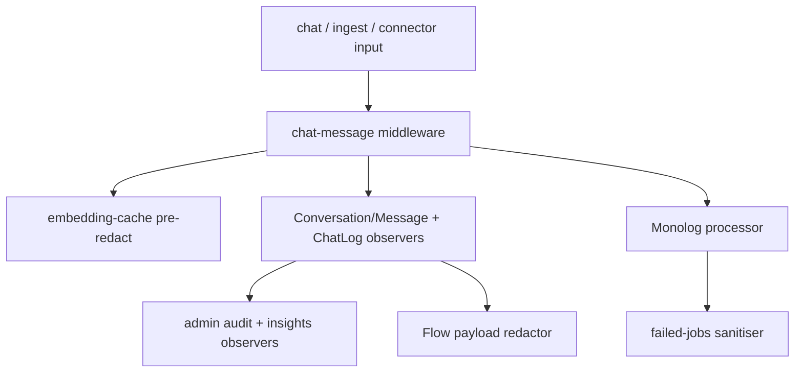

## Motivation

Regulated-industry RAG needs more than data residency: it needs **field-level
redaction inside the application boundary** so PII never lands in a log, a cache,
or an embedding — and an auditable compliance posture for GDPR and the EU AI Act.
AskMyDocs wires both in, default-off and granular, so existing deployments see
byte-identical behaviour until they opt in.

## PII redaction at every persistence boundary

`padosoft/laravel-pii-redactor` is wired at **11 persistence touch-points** so a
piece of PII is redacted wherever it would otherwise be written:



The touch-points span: the chat middleware, embedding-cache pre-redact, the
AI-insights snippet sanitiser, the operator detokenize endpoint, a Monolog
processor, a failed-job listener (deterministic UUID match), the
`Conversation` / `Message` / `ChatLog` / audit / insights `creating`/`saving`
observers, and the Flow payload-redactor contract. EU country packs (Italy,
Germany, Spain), six checksum-validated detectors, four strategies (mask / hash /
tokenise / drop), dual NER drivers. **Every knob is default-OFF.**

A `tokenise` strategy is reversible: the operator **detokenize endpoint** in the
Log Viewer (`POST /api/admin/logs/chat/{id}/detokenize`) round-trips a tokenised
row back to the original. It is gated by the Spatie **permission** configured at
`kb.pii_redactor.detokenize_permission` (default `pii.detokenize`) — 403 otherwise
— and every call is audited. (This is distinct from the cross-mounted PII Redactor
Admin SPA, whose own reverse-lookup uses the `detokenisePiiRedactor` Gate below.)

## EU AI Act compliance pack

`padosoft/laravel-ai-act-compliance` adds a compliance domain + a companion admin
SPA cross-mounted at `/app/admin/ai-act-compliance`:

- **DSAR** — data-subject access/erasure requests (export + delete).
- **Bias monitoring** — a pluggable metric registry (demographic parity /
  equalized odds / calibration) with cohort-drift alerting.
- **Risk register + FRIA** (Art. 27 fundamental-rights impact assessment).
- **Consent + disclosure middleware** — `ai.consent` / `ai.disclosure`.
- **Incident state machine**, human-review tracker, Article 30 attestation PDF,
  a regulatory-feed auto-flagger, and DPO multi-org tenant management.

## RBAC

The `dpo` role exists specifically for these surfaces. The cross-mounted **PII
Redactor Admin** SPA is gated by `viewPiiRedactorAdmin` (admin / dpo / super-admin),
its detokenise ability by the `detokenisePiiRedactor` Gate (dpo / super-admin), and
raw samples by super-admin only. The **Log Viewer** detokenize endpoint (above) is
gated separately by the `pii.detokenize` Spatie permission. **AI Act** is gated by
`viewAiActCompliance` (admin / dpo / super-admin). All are in the R32 authorization
matrix.

## Decision rationale (ADR-style)

Two decisions govern the compliance integration; changing either needs a new ADR:

- **Why extracted packages over inline implementation? (ADR 0011)** Both compliance
  surfaces (`padosoft/laravel-pii-redactor` and `padosoft/laravel-ai-act-compliance`)
  ship as standalone Composer packages. The alternative — inline implementation —
  was rejected because compliance logic evolves on a regulatory timeline (EU AI Act
  enforcement dates, GDPR guidance updates) orthogonal to AskMyDocs feature releases.
  Separate packages allow compliance updates to ship independently and allow
  third-party Laravel hosts to adopt them. The host implements two contracts —
  `UserDataExporter` and `UserDataDeleter` — to unlock DSAR; the contracts are all
  the host knows about the compliance internals.

- **Why default-OFF for every redaction knob? (R43)** Default-ON redaction would
  silently change the stored representations of every existing deployment's data on
  first upgrade — an irreversible migration with no opt-out. Default-OFF makes the
  operator's deliberate choice the activation event, keeping upgrades safe and
  byte-identical until intentionally configured.

## Gotchas & operations

- Every redaction knob is **default-OFF** — opt in per touch-point; a fresh deploy
  redacts nothing until configured.
- Redaction happens **inside** the app boundary (field-level), which is stronger
  than data-residency alone — but it is not a substitute for transport/storage
  encryption.
- Detokenize is a privileged, audited reverse-lookup — never widen its gate.
- **`KB_INGEST_PII_STRATEGY` must match exactly.** Accepted values are `mask`
  (default) and `tokenise` (with a trailing `s`). When redaction is actually
  active — i.e. all of `PII_REDACTOR_ENABLED=true` (package engine),
  `KB_PII_REDACTOR_ENABLED=true` and `KB_CONNECTOR_INGEST_PII_REDACT=true` —
  any other value (including the common typo `tokenize`) throws an
  `InvalidArgumentException` at ingest time so the misconfiguration surfaces
  immediately (R14). If any of those is OFF, `redactContent()` returns the
  original untouched and the value is never consulted (no throw).
- **`tokenise` requires `PII_REDACTOR_SALT`.** The per-tenant token vault uses an
  HMAC salt; the package factory throws loudly if `PII_REDACTOR_SALT` is empty or
  absent. Set it before enabling `tokenise` to avoid ingest failures.

## Ingest redaction strategy (`KB_INGEST_PII_STRATEGY`)

By default, connector ingestion uses one-way **masking** — PII is replaced with
`[REDACTED]` and cannot be recovered. v8.23 adds a **tokenise** mode where PII is
replaced with reversible surrogates (`[tok:email:4a3f…]`) stored in a per-tenant
vault, so an authorised operator can recover the original on demand.

<Warning>
`tokenise` keeps the originals in the package token store. The package default
is `PII_REDACTOR_TOKEN_STORE=memory` (process-local — lost on restart, useless
across workers). For a **persistent, recoverable** vault set
`PII_REDACTOR_TOKEN_STORE=database` (the `pii_token_maps` table) — or `cache`.
</Warning>

| `KB_INGEST_PII_STRATEGY` | `config('kb.pii_redactor.ingest_strategy')` | Behaviour |
|---|---|---|
| `mask` (default) | `mask` | One-way replacement — PII is gone after ingest. |
| `tokenise` | `tokenise` | Reversible surrogate in KB; original in per-tenant vault. Requires `PII_REDACTOR_SALT` + a persistent `PII_REDACTOR_TOKEN_STORE`. |
| anything else | — | `InvalidArgumentException` thrown at ingest time (R14). |

The strategy applies at the **connector ingest boundary**
(`HostIngestionBridge::redactContent`) when **all three** are on: the package
engine `PII_REDACTOR_ENABLED=true` (otherwise `RedactorEngine::redact()` is a
no-op), the host master switch `KB_PII_REDACTOR_ENABLED=true`, and
`KB_CONNECTOR_INGEST_PII_REDACT=true`.

### Inline ingestion path (v8.23/PR2)

The same redaction now also runs on the **inline** ingestion path — the HTTP
`POST /api/kb/ingest` batch and the `kb:ingest-folder` CLI. Both dispatch
`IngestDocumentJob`, which runs the `kb.ingest` **Flow saga**
(`parse-markdown → chunk-document → embed-chunks → persist-chunks`). The
**`chunk-document`** step redacts each chunk's text — through the shared
`App\Services\Kb\Pii\ChunkRedactor` — so the downstream `embed-chunks` and
`persist-chunks` steps (which both read the chunk drafts) only ever see
surrogates. The vector store + `chunk_text` therefore never hold raw PII while
the per-tenant vault keeps the originals. (The legacy direct path,
`DocumentIngestor::persistFromDrafts()`, redacts through the same `ChunkRedactor`
after its idempotency short-circuit, so both code paths share one contract.)

Redaction is deliberately scoped to the chunk text, not the whole markdown: the
raw markdown stays the idempotency anchor (`document_hash`) and the canonical
frontmatter stays parseable. Tokens are deterministic, so a re-ingest of
identical content yields identical surrogates and remains idempotent (same
`chunk_hash`). On a **dry-run** preview the redactor forces the side-effect-free
`mask` strategy, so a preview never mints vault tokens and never stores raw PII.

The inline path is gated by `KB_INLINE_INGEST_PII_REDACT` (default **OFF**, R43)
on top of the same two master flags.

### Per-(tenant, project) policy (`kb_pii_settings`)

Because the inline path has the project key (the connector boundary does not),
the effective on/off + strategy are resolved **per project** by
`KbPiiPolicyResolver`, layering most-specific-wins:

```
config('kb.pii_redactor.*')  →  kb_pii_settings (tenant, '*')  →  kb_pii_settings (tenant, project)
```

So a tenant can mask everywhere but `tokenise` only the `support` project, or
keep ingestion raw globally and opt one project in — without a deploy. The
policy is **tri-surface** (R44) over the one `KbPiiPolicyResolver` core:

| Surface | Read | Write |
|---|---|---|
| HTTP | `GET /api/admin/pii/policy` (`viewPiiRedactorAdmin`) | `PUT /api/admin/pii/policy` (`manageKbPiiPolicy` — dpo / super-admin) |
| CLI | `kb:pii-policy --tenant= --project=` | — |
| MCP | `KbPiiPolicyTool` (read-only) | — |

Every row is tenant-scoped (R30) with a composite `UNIQUE(tenant_id, project_key)`.

## Re-identification (detokenise) — tri-surface, gated, audited (v8.23/PR3)

Re-identification is **JIT and gated**: an authorised operator restores the
originals for a single request; the redacted form stays the system-of-record
and the plaintext is never cached. It is delivered tri-surface (R44) over one
`App\Services\Kb\Pii\DetokenizeService` core:

| Surface | Endpoint / tool | Authorization |
|---|---|---|
| HTTP | `POST /api/admin/pii/documents/{id}/detokenize` | `viewPiiRedactorAdmin` group + the `pii.detokenize` permission (dpo / super-admin) |
| CLI | `kb:detokenize-document {id} --tenant=` | operator (shell access) |
| MCP | `KbDetokenizeTool` | MCP authorizer (admin/super-admin) **+** `pii.detokenize` → net **super-admin only** |

Every surface enforces the **`tokenise` strategy preflight** (422 / error under
mask/hash/drop — nothing was minted to reverse) and is **tenant-scoped** (R30 —
an operator cannot re-identify another tenant's document by id). A **completed
unmask** and a **permission-denied attempt** each write an immutable
`admin_command_audit` row (`command='pii.detokenize'`,
`status=completed|rejected`, with the `surface`). The strategy-preflight refusal
and the not-found path are deliberately **not** audited — no unmask is attempted
in either case (consistent with the chat-log precedent).
The document lookup deliberately bypasses the per-project `AccessScopeScope` read
ACL — a DPO servicing a DSAR must reach any document in the tenant — while the
tenant boundary and the permission gate remain in force. The MCP tool is the
single tool that can surface raw PII, so it carries the tightest gate.

The **chat-log** sibling (`POST /api/admin/logs/chat/{id}/detokenize`) and the
PII Redactor Admin SPA cross-mounted at `/app/admin/pii-redactor` provide the
same capability for conversation rows (both RBAC-gated and audited).

## Right-to-erasure (GDPR Art.17) — crypto-shred (v8.23/PR4)

Because tokenisation is **pseudonymisation** (GDPR Art.4(5)), the indexed
surrogates remain personal data — but the per-tenant vault makes **erasure**
cheap and total: destroying the `pii_token_maps` row(s) for a subject's value(s)
**crypto-shreds** the only link between a `[tok:...]` surrogate and the real
person. Every surrogate left in the KB / chat / embeddings becomes permanently
unresolvable (detokenise returns it unresolved), so the data is no longer
personal data linkable to the subject — **without rewriting every downstream
row**. This is the canonical vault-erasure pattern (Skyflow / DLP).

It is delivered tri-surface (R44) over one `App\Services\Kb\Pii\SubjectErasureService`:

| Surface | Entry | Authorization |
|---|---|---|
| HTTP | `POST /api/admin/pii/erase-subject` `{values:[…]}` | `viewPiiRedactorAdmin` group + the `pii.erase` permission (dpo / super-admin) |
| CLI | `kb:erase-subject <value…> --tenant=` | operator (shell access) |
| MCP | `KbEraseSubjectTool` | write tool → MCP authorizer super-admin **+** `pii.erase` → super-admin only |

Erasure is **tenant-scoped** (R30 — a value is shredded ONLY in the caller's
tenant; two tenants holding the same value are independent) and **audited**
(`admin_command_audit`, `command='pii.erase'` — the audit records only the value
*count*, never the raw PII, so the trail itself is not a PII sink).

### DSAR (Art.15 access + Art.17 erasure)

The same core is wired into the `padosoft/laravel-ai-act-compliance` **DSAR**
flow via the host's `UserDataExporter` / `UserDataDeleter` implementations:

- an Art.17 **delete** request crypto-shreds the subject's vault entries (keyed
  by their email) in every tenant they have data in, inside the same atomic
  transaction that wipes their conversations / chat-logs / audit rows;
- an Art.15 **export** request surfaces a `pii_vault` snapshot — the vault
  entries the system can still re-identify to the subject's PII — so the access
  response is complete.

<CardGroup cols={2}>
  <Card title="Multi-tenant isolation" icon="building-shield" href="/multi-tenant-isolation">
    The tenant boundary that complements field-level redaction.
  </Card>
  <Card title="Evidence & Risk Review" icon="shield-check" href="/evidence-risk-review">
    The answer-grounding risk firewall.
  </Card>
</CardGroup>
