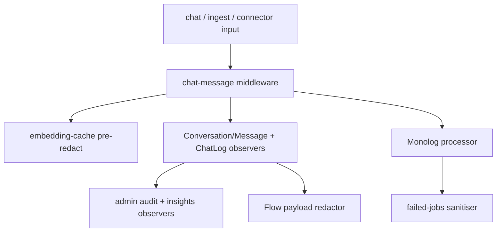

## Motivation

Regulated-industry RAG needs more than data residency: it needs **field-level
redaction inside the application boundary** so PII never lands in a log, a cache,
or an embedding — and an auditable compliance posture for GDPR and the EU AI Act.
AskMyDocs wires both in, default-off and granular, so existing deployments see
byte-identical behaviour until they opt in.

## PII redaction at every persistence boundary

`padosoft/laravel-pii-redactor` is wired at **11 persistence touch-points** so a
piece of PII is redacted wherever it would otherwise be written:

The touch-points span: the chat middleware, embedding-cache pre-redact, the
AI-insights snippet sanitiser, the operator detokenize endpoint, a Monolog
processor, a failed-job listener (deterministic UUID match), the
`Conversation` / `Message` / `ChatLog` / audit / insights `creating`/`saving`
observers, and the Flow payload-redactor contract. EU country packs (Italy,
Germany, Spain), six checksum-validated detectors, four strategies (mask / hash /
tokenise / drop), dual NER drivers. **Every knob is default-OFF.**

A `tokenise` strategy is reversible: the operator **detokenize endpoint** in the
Log Viewer (`POST /api/admin/logs/chat/{id}/detokenize`) round-trips a tokenised
row back to the original. It is gated by the Spatie **permission** configured at
`kb.pii_redactor.detokenize_permission` (default `pii.detokenize`) — 403 otherwise
— and every call is audited. (This is distinct from the cross-mounted PII Redactor
Admin SPA, whose own reverse-lookup uses the `detokenisePiiRedactor` Gate below.)

## EU AI Act compliance pack

`padosoft/laravel-ai-act-compliance` adds a compliance domain + a companion admin
SPA cross-mounted at `/app/admin/ai-act-compliance`:

- **DSAR** — data-subject access/erasure requests (export + delete).
- **Bias monitoring** — a pluggable metric registry (demographic parity /
  equalized odds / calibration) with cohort-drift alerting.
- **Risk register + FRIA** (Art. 27 fundamental-rights impact assessment).
- **Consent + disclosure middleware** — `ai.consent` / `ai.disclosure`.
- **Incident state machine**, human-review tracker, Article 30 attestation PDF,
  a regulatory-feed auto-flagger, and DPO multi-org tenant management.

## RBAC

The `dpo` role exists specifically for these surfaces. The cross-mounted **PII
Redactor Admin** SPA is gated by `viewPiiRedactorAdmin` (admin / dpo / super-admin),
its detokenise ability by the `detokenisePiiRedactor` Gate (dpo / super-admin), and
raw samples by super-admin only. The **Log Viewer** detokenize endpoint (above) is
gated separately by the `pii.detokenize` Spatie permission. **AI Act** is gated by
`viewAiActCompliance` (admin / dpo / super-admin). All are in the R32 authorization
matrix.

## Decision rationale (ADR-style)

Two decisions govern the compliance integration; changing either needs a new ADR:

- **Why extracted packages over inline implementation? (ADR 0011)** Both compliance
  surfaces (`padosoft/laravel-pii-redactor` and `padosoft/laravel-ai-act-compliance`)
  ship as standalone Composer packages. The alternative — inline implementation —
  was rejected because compliance logic evolves on a regulatory timeline (EU AI Act
  enforcement dates, GDPR guidance updates) orthogonal to AskMyDocs feature releases.
  Separate packages allow compliance updates to ship independently and allow
  third-party Laravel hosts to adopt them. The host implements two contracts —
  `UserDataExporter` and `UserDataDeleter` — to unlock DSAR; the contracts are all
  the host knows about the compliance internals.

- **Why default-OFF for every redaction knob? (R43)** Default-ON redaction would
  silently change the stored representations of every existing deployment's data on
  first upgrade — an irreversible migration with no opt-out. Default-OFF makes the
  operator's deliberate choice the activation event, keeping upgrades safe and
  byte-identical until intentionally configured.

## Gotchas & operations

- Every redaction knob is **default-OFF** — opt in per touch-point; a fresh deploy
  redacts nothing until configured.
- Redaction happens **inside** the app boundary (field-level), which is stronger
  than data-residency alone — but it is not a substitute for transport/storage
  encryption.
- Detokenize is a privileged, audited reverse-lookup — never widen its gate.

<CardGroup cols={2}>
  <Card title="Multi-tenant isolation" icon="building-shield" href="/multi-tenant-isolation">
    The tenant boundary that complements field-level redaction.
  </Card>
  <Card title="Evidence & Risk Review" icon="shield-check" href="/evidence-risk-review">
    The answer-grounding risk firewall.
  </Card>
</CardGroup>
