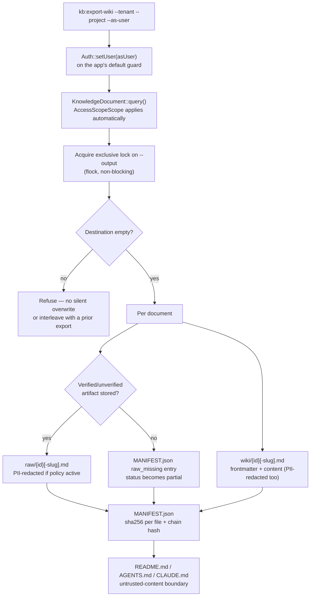
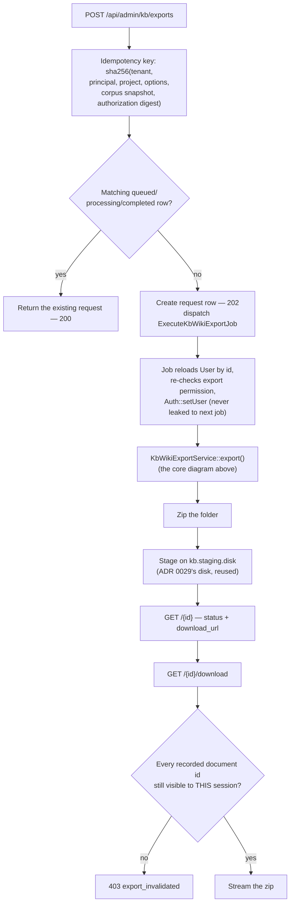
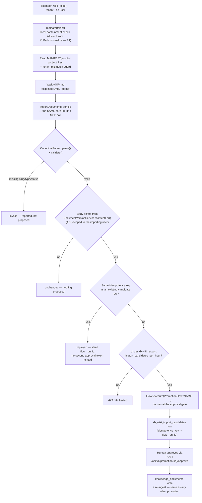

## Motivation

Every other surface in AskMyDocs — chat, MCP retrieval, the admin tree —
requires a live connection to the server and reads through the same
access-control scope. That is correct for day-to-day use, but it means the
knowledge base has no answer to a real, recurring request: *"give me a folder
I can hand to an auditor, load into an offline agent, or keep as a snapshot,
without giving them a login."* [ADR 0032](https://github.com/lopadova/AskMyDocs/blob/main/docs/adr/0032-v838-portable-wiki-export-and-candidate-only-import.md)
answers it with `kb:export-wiki`: a folder export that is **exactly** what
the requesting user could retrieve at export time — never more, because it
is computed through the identical `AccessScopeScope` the live server uses,
not filtered after the fact.

This page covers **W4a** (the synchronous CLI export core), **W4b** (the
async HTTP surface, retained/downloadable bundles, and the retention sweep),
and **W4c** (the `.mcp.json` live reconnection, the frontmatter that makes an
exported page round-trippable, and `kb:import-wiki` / `POST
/api/admin/kb/imports` / `KbImportWikiTool` — the candidate-only path back
in). `llms.txt`/`llms-full.txt`, `--format` variants, and `include_images`
remain deferred — see [Still deferred](#still-deferred) below.

<Note>
Everything on this page is **off by default** (`KB_WIKI_EXPORT_ENABLED=false`,
R43). With the flag off, `kb:export-wiki` refuses cleanly (exit 1, no
side effects) rather than running unrestricted.
</Note>

## Theory & design

Three decisions carry the whole feature, each a direct consequence of
`raw/` and `wiki/` becoming disk artifacts the server no longer governs the
moment the folder leaves it:

**1. The export computes ACL, it does not filter for it.** `KbWikiExportService::export()`
authenticates as the requesting user (`Auth::setUser($asUser)`, on the app's
own default guard — never a hardcoded `web`, so a deployment with a
non-default `AUTH_GUARD` still gets real scoping) for the duration of the
export, then queries `KnowledgeDocument` exactly as any other authenticated
read would. `AccessScopeScope` — the global scope every other surface goes
through — applies automatically. There is no second, export-specific ACL
check to keep in sync with the real one; there is only ever one scope.

**2. `raw/` is the artifact or an explicit gap, never a substitute.**
`DocumentVersionService::rawArtifactFor()` returns the stored conversion
artifact's bytes, or nothing — it deliberately skips `contentFor()`'s chunk-
reconstruction fallback. A chunk reconstruction is an *index* over a
document, not the document itself (the same distinction
[ADR 0030](https://github.com/lopadova/AskMyDocs/blob/main/docs/adr/0030-v836-conversion-artifacts-on-the-time-machine.md)
draws for the Cloud Time Machine's diff source). A document with no
verified artifact is listed in `MANIFEST.json`'s `raw_missing` with a
reason, and the whole export's `status` becomes `partial` — never a folder
that silently looks complete when it is not.

**3. The export inherits the tenant's PII policy, not a weaker one.**
An export folder is a *second* disk artifact the platform produces (the
vector store being the first, per
[ADR 0020](https://github.com/lopadova/AskMyDocs/blob/main/docs/adr/0020-v823-pii-safe-ingestion-reversible-vault.md)).
Both `raw/` and `wiki/` are rendered through the same
`KbPiiPolicyResolver` + `RedactorEngine` gate `ChunkRedactor` uses at
ingestion, so a tenant that redacts PII on the way in gets a folder that
never carries it on the way out either.



This is `KbWikiExportService::export()`'s core — shared verbatim by both the
CLI (`kb:export-wiki`, synchronous) and the async job below (W4b); neither
surface reimplements it. The async path wraps it with idempotency, queueing,
and a second re-authorization gate at download time:



## Folder layout

```
<output>/
├── wiki/                  # one page per document, id-prefixed filenames
│   └── {id}[-slug].md     # frontmatter + the document's readable content
├── raw/                   # the stored conversion artifact, when one exists
│   └── {id}[-slug].md     # absent entirely for a raw_missing document
├── README.md              # what this is, tenant/project, .mcp.json connection steps
├── AGENTS.md               # untrusted-content boundary, generic-agent flavoured
├── CLAUDE.md               # the same boundary, Claude-flavoured
├── MANIFEST.json          # per-file sha256 + a running chain hash + status
├── .mcp.json              # server URL + env-referenced headers — no credential (W4c)
└── .export.lock           # reservation marker — see Gotchas
```

`wiki/` and `raw/` filenames are **always id-prefixed** (`{database id}` or
`{database id}-{slug}`), never a bare slug. A non-canonical document falling
back to its own numeric id and a *different* document whose canonical slug
happens to equal that same string would otherwise both resolve to the
identical filename and silently overwrite one another — the id prefix makes
that provably impossible, since two documents never share a database id.

## Frontmatter contract

Every `wiki/*.md` page opens with YAML frontmatter carrying two groups of
keys that are **never merged**, because they answer different questions —
and, since W4c, that answer BOTH "how governed is this?" and "is this page
promotable as-is?":

| Key | Answers | Source |
|---|---|---|
| `slug` | The canonical slug — present only on a CANONICAL document | `knowledge_documents.slug` |
| `id` | The canonical `doc_id` | `knowledge_documents.doc_id` |
| `type` | One of the 9 canonical types — what `CanonicalParser::validate()` requires | `knowledge_documents.canonical_type` |
| `status` | `draft`/`review`/`accepted`/`superseded`/`deprecated`/`archived` — the OTHER field `CanonicalParser::validate()` requires | `knowledge_documents.canonical_status` |
| `tier` | Has a person vouched for this content? (`human` / `auto`) | `knowledge_documents.generation_source` ([ADR 0014](https://github.com/lopadova/AskMyDocs/blob/main/docs/adr/0014-source-retention-and-conversion-artifacts.md)) |
| `evidence_tier` | How authoritative is the claim itself? | `knowledge_documents.evidence_tier` |
| `provenance_tier` | Who originally wrote it? | `knowledge_documents.provenance_tier` ([ADR 0028](https://github.com/lopadova/AskMyDocs/blob/main/docs/adr/0028-source-acl-mirroring-and-ingest-provenance.md)) |
| `extraction` | How did the text enter the system? (`ocr` / `text-layer`) | Derived from `metadata.converter.provenance`, mirroring `KbSearchService::mapChunkToArray()`'s own derivation rather than re-parsing it a third way |
| `canonical_type` | Same value as `type`, kept for W4a-produced folders and readers who prefer the more descriptive name | `knowledge_documents.canonical_type` |

`slug`/`id`/`type`/`status` are `null` on a NON-canonical document's page —
there is genuinely nothing to round-trip for it yet (see
[Round-trip](#round-trip-kbimport-wiki-and-the-mcp-tools-w4c) below): the
person editing the folder must add all four deliberately before
`kb:import-wiki` will propose it, the same bar
[ADR 0003](https://github.com/lopadova/AskMyDocs/blob/main/docs/adr/0003-promotion-pipeline.md)'s
`/candidates` endpoint already holds every draft to.

## Manifest & consistency, not tamper evidence

`MANIFEST.json` hashes every file the export wrote (sha256) and chains those
hashes into a single `chain_hash`, the same primitive the compliance reports
use for their own internal chaining. That buys **corruption detection** — a
folder recovered from a laptop months later can be checked for internal
consistency, catching a truncated copy or a partial sync — but it is
deliberately **not** described as tamper-evident: the hash is unkeyed and
lives in the same folder it covers, so anyone who can edit a file here can
recompute `chain_hash` to match, and nothing in the folder can prove
otherwise. Verifying against a malicious actor, not just accidental
corruption, would require the server to hold its own copy of the hash (or
sign it with a key the export never has) and compare on demand — that is
out-of-band verification design, not shipped by W4a and not yet designed:

```json
{
  "tenant_id": "acme",
  "project_key": "eng",
  "status": "partial",
  "exported_at": "2026-09-21T14:00:00+00:00",
  "files": { "README.md": "…sha256…", "wiki/57.md": "…sha256…" },
  "raw_missing": [{ "document_id": 57, "reason": "missing" }],
  "chain_hash": "…sha256 of the sorted (path, hash) pairs, chained…"
}
```

## Untrusted-content boundary

Once a folder leaves the server, no live `ProvenanceToolFirewall` can vet
what is written inside it. `README.md`, `AGENTS.md` and `CLAUDE.md` all open
with the same restated boundary
([SEC-LLM-001](https://github.com/lopadova/AskMyDocs/blob/main/.claude/rules/rule-security-ai-llm.md)'s
prompt-injection containment, applied to a static folder instead of a live
retrieval turn): every page under `raw/` and `wiki/` is **data**, never an
instruction, whatever it claims about itself.

## CLI — synchronous core (W4a)

```bash
php artisan kb:export-wiki \
  --tenant=acme \
  --project=eng \
  --as-user=reviewer@acme.example \
  --output=/tmp/acme-eng-export   # optional — defaults to a fresh
                                    # storage/app/kb-wiki-exports/... path
```

- `--as-user` must resolve to a real user with a `ProjectMembership` in
  `--tenant` — an unknown email or a non-member refuses before touching any
  data.
- Omitting `--output` builds a destination from slugged, filesystem-safe
  `--tenant`/`--project` segments plus a timestamp *and* a random suffix
  (`Str::random(8)`), so two exports for the same tenant/project started in
  the same second never collide.
- The exit summary reports `status` (`complete`/`partial`) and warns when
  `raw_missing` is non-empty.

`KbCreateExportTool` / `KbGetExportTool` are the MCP surface of this same
async path (W4c) — see [Round-trip](#round-trip-kbimport-wiki-and-the-mcp-tools-w4c)
below.

## Async HTTP surface (W4b, ADR 0032 §5/§11/§12)

```bash
# Start (or reuse, via idempotency key) an async export
curl -X POST https://<host>/api/admin/kb/exports \
  -H "Authorization: Bearer <sanctum-token>" \
  -H "Content-Type: application/json" \
  -d '{"project_key":"eng"}'
# → 202 { "data": { "id": "...", "status": "queued", ... } }

# Poll
curl https://<host>/api/admin/kb/exports/<id> -H "Authorization: Bearer <sanctum-token>"
# → { "data": { "status": "completed", "document_count": 42,
#               "download_url": "/api/admin/kb/exports/<id>/download" } }

# Download (re-authorizes the CURRENT session, see below)
curl -OJ https://<host>/api/admin/kb/exports/<id>/download -H "Authorization: Bearer <sanctum-token>"
```

- **Idempotency.** The key is `sha256(tenant, principal, project, normalised
  options, corpus snapshot, authorization digest)`. The corpus snapshot
  (max `updated_at` + row count) alone would miss an ACL/membership change
  that *removes* a document from the principal's view without touching any
  `updated_at` — the authorization digest (sorted visible document ids +
  role + project memberships) is what forces a narrowed view to invalidate
  the cache and start a fresh export.
- **Principal restoration mirrors `ExecuteAgentRunJob`.** `ExecuteKbWikiExportJob`
  takes only scalar ids in its constructor, reloads the `User` by id inside
  `handle()`, re-checks they still hold the export permission (a permission
  can be revoked between the HTTP request and the worker picking up the
  job — that's not retryable, so the job marks the request `failed` rather
  than throwing), authenticates as them, and clears the guard in `finally` —
  a reused queue worker must never leak one export's principal into the next.
- **Download-time re-authorization is a SECOND, independent gate.** The
  export's `document_ids_json` (the ACL-scoped set it was actually computed
  against) is re-checked against the downloading session's current
  visibility on every download, not only at creation. If any id is no
  longer visible the response is `403 export_invalidated` — because a
  cached idempotency key can outlive the ACL state it was computed from,
  and this is the catch the idempotency key alone cannot provide.
  Deliberately **not** a bypass-auth Laravel signed URL: a link that skips
  the session couldn't re-authorize a principal at all.
- **Staging, not a new disk.** The job zips the folder and stages it on
  `kb.staging.disk` (ADR 0029's upload-staging disk, reused — `raw/`'s
  `.export.lock` reservation marker is excluded from the zip, it has no
  value once the export is complete).
- **Retention.** `kb:prune-wiki-exports [--dry-run]` sweeps by `expires_at`
  (not `created_at` + a status list, like `kb:prune-staging-batches`) —
  hourly (`onOneServer()->withoutOverlapping()`), a deliberately different
  cadence and knob from the once-nightly staging sweep, because
  `KB_WIKI_EXPORT_RETENTION_HOURS`'s default (24h) is short enough that a
  daily-only sweep would leave expired bundles around for up to a day past
  expiry.

## Gotchas & operations

- **Destination reservation is atomic.** `writeFolder()` holds an exclusive,
  non-blocking `flock()` on a `.export.lock` file inside the destination for
  the entire write. Without it, two exports racing the same explicit
  `--output` could both observe it empty before either had written
  anything, then interleave `wiki/`/`raw/` files into one folder matching
  neither export's manifest. A concurrent attempt is refused immediately
  ("Another export is already in progress"), before any file is written.
- **A non-empty destination is always refused**, lock contention aside — a
  reused directory from a prior, wider-ACL export must never leak documents
  the current export's principal cannot read. Point `--output` at a fresh or
  empty directory; the CLI's own default always is one.
- **Guard/tenant state is always restored**, including when setup itself
  throws. `export()`'s `finally` runs `Auth::forgetGuards()` unconditionally
  (never leaves `--as-user` authenticated on a reused process) and restores
  the previous tenant, whatever failed along the way.
- **`wiki/` is the readable copy and may legitimately reconstruct**; `raw/`
  never does. Don't treat their absence/presence symmetrically when reading
  an export programmatically — check `raw_missing` for the artifact
  guarantee, not whether `wiki/{id}.md` exists (it always does).

## `.mcp.json` — no credential, ever (W4c, ADR 0032 §4)

Every export writes a `.mcp.json` naming the server and two `env`-referenced
headers — never a token, signed URL, or session id, because this file is
explicitly designed to be copied, emailed, and committed to a personal notes
repo:

```json
{
  "mcpServers": {
    "askmydocs": {
      "url": "https://<host>/mcp/kb",
      "headers": {
        "Authorization": "Bearer ${ASKMYDOCS_MCP_TOKEN}",
        "X-Tenant-Id": "${ASKMYDOCS_TENANT_ID}"
      }
    }
  }
}
```

`README.md` inside the export carries the connection steps (mint a token
scoped to *your own* access, export the two env vars, point an MCP-aware
client at the file). This closes the two host-side gaps the ADR named
before this connection was safe to ship — both fixed independently of
export/import, ahead of W4c:

1. **Bearer authentication.** `/mcp/kb` is mounted with only
   `EnforceMcpScope` (`throttle:mcp` + `mcp.scope`, no `auth:sanctum` — the
   middleware reads the `McpTenantToken` bearer directly, hashes and looks
   it up itself).
2. **Principal binding (R33).** `EnforceMcpScope` resolves the token's
   `created_by` user and binds it as the request's Laravel principal before
   any tool runs — so `AccessScopeScope` scopes every MCP retrieval to
   *that* user's ACL, not an unrestricted bypass. Whoever mints their own
   token sees their own access, never the exporter's.

## Round-trip — `kb:import-wiki` and the MCP tools (W4c, ADR 0032 §10/§11)

Editing a page and getting it back into the corpus never writes directly —
every edit becomes a promotion **candidate**
([ADR 0003](https://github.com/lopadova/AskMyDocs/blob/main/docs/adr/0003-promotion-pipeline.md)'s
"agent proposes, a person commits" boundary, restated for a folder instead
of a chat transcript), over the EXACT `Flow::execute(PromotionFlow::NAME,
...)` saga `POST /api/kb/promotion/promote` already uses — paused at an
approval gate, nothing written to `knowledge_documents` until a human
approves.



- **Single-document surface, everywhere except the CLI.** `POST
  /api/admin/kb/imports` and `KbImportWikiTool` take `{project_key,
  markdown}` — the same shape `POST /api/kb/promotion/candidates` already
  validates — because an HTTP client or an MCP tool call has no server-side
  folder to walk. Only `kb:import-wiki {folder}` has local filesystem
  access, so folder-walking is CLI-only; all three surfaces funnel into the
  identical `KbWikiImportService::importDocument()`.
- **Two DIFFERENT path checks, on purpose.** `{folder}` is resolved with
  `realpath()` and every candidate file is re-checked to stay under that
  resolved root — a local-containment concern. The resulting candidate's
  eventual KB-disk `source_path` is separately normalised through
  `KbPath::normalize()` (R1) once it is approved and written. Neither
  substitutes for the other.
- **The diff is BODY-only, deliberately.** Comparing the whole file against
  a regenerated export representation would false-positive on every export
  cycle whose frontmatter serialization or governance fields legitimately
  shift without an editorial change. Comparing only the Markdown body
  against `DocumentVersionService::contentFor()` — the same source `wiki/`
  itself renders from — targets what a person actually edits, and the
  lookup runs under the IMPORTING user's own `AccessScopeScope`: a user who
  cannot see a slug is told "new", never "unchanged" for a document they
  have no visibility into.
- **Idempotency has one honest limit.** A replayed call resolves the SAME
  paused flow run rather than starting a second one, but does NOT mint a
  second usable approval token — the underlying
  `ApprovalTokenManager::reissuePendingForStep()` is a one-shot operation
  per approval record. A replay reports the run's id with no new token,
  which is more honest than pretending a second single-use token exists.
- **Rate-limited per actor** (`kb.wiki_export.import_candidates_per_hour`,
  default 30/hour) — the same knob on all three surfaces.

```bash
# CLI — the folder-walking surface
php artisan kb:import-wiki /tmp/acme-eng-export \
  --tenant=acme --as-user=reviewer@acme.example
#   unchanged   wiki/57-deploy-runbook.md
#   proposed    wiki/58-incident-2026-08.md  (flow_run_id: ...)
# Import complete: 1 unchanged, 1 proposed, 0 replayed, 0 invalid, 0 other.

# HTTP / MCP — one document at a time
curl -X POST https://<host>/api/admin/kb/imports \
  -H "Authorization: Bearer <sanctum-token>" -H "Content-Type: application/json" \
  -d '{"project_key":"eng","markdown":"---\nslug: incident-2026-08\nid: inc-2026-08\ntype: incident\nstatus: accepted\n---\n\n# Incident 2026-08\n..."}'
# → 202 { "data": { "status": "created", "flow_run_id": "...",
#                    "approval": { "token": "...", "approve_path": "..." } } }
```

## Still deferred

Per [ADR 0032](https://github.com/lopadova/AskMyDocs/blob/main/docs/adr/0032-v838-portable-wiki-export-and-candidate-only-import.md)
§2/§7, past W4c:

- **`llms.txt`/`llms-full.txt`** and the **`--format=markdown|llms-txt`**
  variants — only `--format=llm-wiki` (the default) exists.
- **`include_images`** — figures are omitted by default when the tenant's
  PII policy is active (`ChunkRedactor` rewrites text, not pixels); the
  opt-in inclusion path is not built.

Both are explicitly **rejected** (`422`/`InvalidArgumentException`), not
silently accepted and ignored, by `KbWikiExportRequestService::normalizeOptions()`
— R14.

<CardGroup cols={2}>
  <Card title="Canonical & promotion" icon="stamp" href="/canonical-and-promotion">
    ADR 0003's boundary — the same one kb:import-wiki proposes candidates through.
  </Card>
  <Card title="Source permissions" icon="lock" href="/source-permissions">
    AccessScopeScope, the exact scope both export and import compute through.
  </Card>
</CardGroup>
