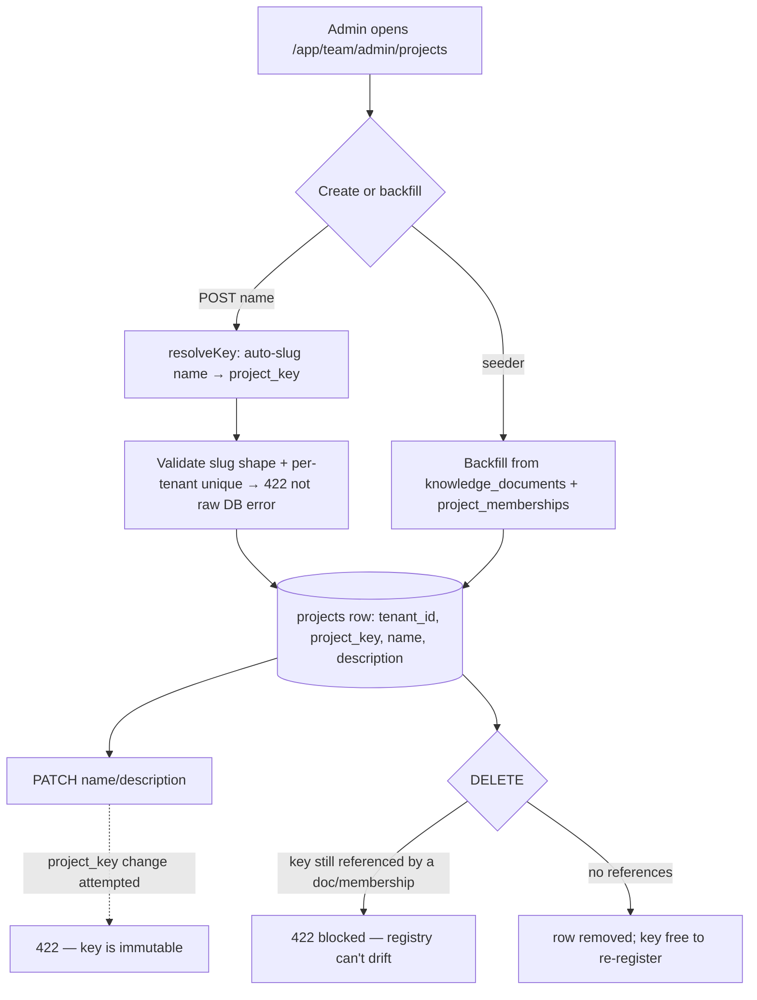

## Motivation

Every document, chunk, chat log, membership, node and edge in AskMyDocs carries a
`project_key` — the stable string that scopes retrieval and groups knowledge. For
most of the system's life that key was **implicit**: it existed only as a column
value, born the first time a document was ingested under it. That works, but it
gives operators nothing to *manage* — no human-readable name, no description, no
single place to see "which projects exist in this team", and no guard against a
typo minting a brand-new silent project.

The **project registry** promotes `project_key` to a first-class row. A project
now has a name and a description, a governed lifecycle, and a delete-guard — while
staying a **soft registry**: the key keeps working everywhere even when no
registry row exists, so the feature is purely additive (R27) and existing
deployments are unaffected until they choose to name their projects.

## Lifecycle



The key is **auto-slugged from the name** on create (`resolveKey` lowercases and
hyphenates), validated for slug shape and per-tenant uniqueness so the operator
gets a clean **422** instead of a raw DB integrity error, and is **immutable**
afterwards — changing it would orphan every row that references it.

## Data model

The `projects` table is tenant-aware (R30/R31):

| Column | Notes |
|---|---|
| `tenant_id` | `string(50)` default `'default'`, indexed — auto-filled via `BelongsToTenant` |
| `project_key` | the stable join key (slug shape `^[a-z0-9]+(-[a-z0-9]+)*$`) |
| `name` | human label, required, `max:200` |
| `description` | optional, `max:2000` |
| `created_at` / `updated_at` | timestamps |

**Uniqueness is per-tenant, not global**: `UNIQUE (tenant_id, project_key)` (R28).
Two different teams may legitimately both own `engineering` — the tenant boundary
is the only safe scope. There is **no hard FK** from documents/memberships to
`projects`: the registry is a projection that can be rebuilt from the content it
describes, never a gate the content depends on.

**Memberships** are the access-control companion: `POST /api/admin/users/{user}/memberships`
ties a user to a `project_key` (with an optional scope allowlist of folder globs /
tags), and `PATCH` / `DELETE /api/admin/memberships/{membership}` manage it. A
membership row is exactly what the tenant-authorize middleware checks when a user
sends an `X-Tenant-Id` for a team they don't own (see [admin cockpit](/admin-panel)).

## Design rationale (ADR-style)

- **Why a soft registry, not a hard FK.** AskMyDocs treats canonical markdown as
  the source of truth and the DB as a rebuildable projection. A hard FK from
  `knowledge_documents.project_key → projects.project_key` would invert that: you
  could no longer ingest a document under a new key without first creating a
  registry row, and a `kb:rebuild-graph` could fail on a missing parent. The soft
  registry keeps ingestion unconditionally additive and the registry purely a
  governance/UX layer. The trade-off — a key can exist in content without a
  registry row — is handled by **backfill** (the seeder mints rows from existing
  `knowledge_documents` + `project_memberships`) and by the delete-guard below.
- **Why the key is immutable.** Renaming `project_key` would silently orphan every
  document, chunk, membership, node and edge that references it. Rather than
  cascade a rename across six tables, `update()` rejects any key change with 422
  and the UI hides the field — create a new project and re-ingest instead.
- **Why delete is guarded, not cascading.** Deleting a registry row must never
  delete the *content*. So `DELETE` is blocked with 422 while any
  `knowledge_document` (counted with `whereNull('deleted_at')`, so soft-deleted
  docs don't block) or `project_membership` still references the key — the
  registry can never drift out of sync by removing an in-use project.

## Worked example

```bash
# Create — project_key is auto-slugged from the name.
curl -sX POST https://kb.example.com/api/admin/projects \
  -H "X-Tenant-Id: acme" -H "Authorization: Bearer $TOKEN" \
  -H 'Content-Type: application/json' \
  -d '{"name":"HR Portal","description":"People-ops runbooks"}'
# → 201 { "data": { "id": 7, "project_key": "hr-portal", "name": "HR Portal", ... } }

# Rename the label (key stays put).
curl -sX PATCH https://kb.example.com/api/admin/projects/7 \
  -H "X-Tenant-Id: acme" -H "Authorization: Bearer $TOKEN" \
  -H 'Content-Type: application/json' -d '{"name":"HR & People Ops"}'

# Attempting to change the key → 422 (immutable).
# Deleting while documents still reference "hr-portal" → 422 (in use).
```

## Tri-surface (R44)

The registry CRUD is a **deliberate single-surface exception**. A `project_key`
is already usable across every surface — CLI `kb:ingest-folder`, HTTP
`POST /api/kb/ingest`, and the MCP retrieval tools (`KbSearchByProjectTool`) — *without*
a registry row; the row only adds a human name/description and the delete-guard for
the admin UI. No agent workflow needs to create or rename a registry entry, so the
CRUD ships HTTP-only (no Artisan command, no MCP tool) on purpose. The rationale is
recorded in the `ProjectController` class docblock.

## Gotchas & operations

- **Two teams, one key is normal.** Never assume global `project_key` uniqueness;
  the uniqueness constraint and every query are tenant-scoped.
- **A key without a row is valid.** Documents ingested before the registry existed
  (or via the API/CLI directly) work fine; run the backfill seeder to give them
  registry rows, or create the project in the UI.
- **`chat_logs`-only keys are not backfilled.** A `project_key` that ever appeared
  *only* in chat telemetry (never in a document or membership) won't get a registry
  row — chat-log keys are free-form telemetry, not managed projects.
- **RBAC:** the whole surface is `auth:sanctum` + `tenant.authorize` +
  `role:admin|super-admin`, covered by the authorization matrix (R32) — see
  [the admin cockpit](/admin-panel) and
  [multi-tenant isolation](/multi-tenant-isolation).
