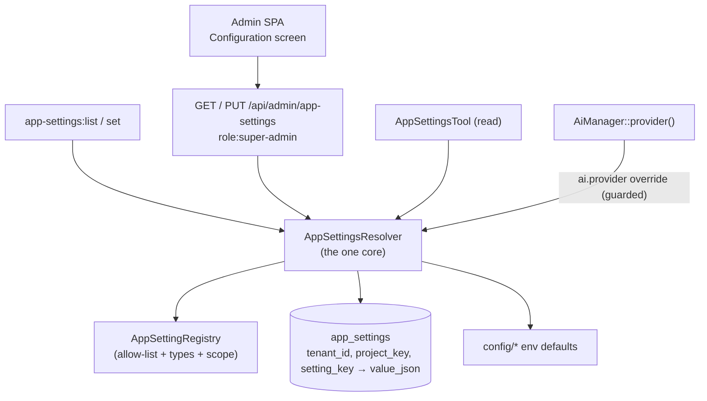

## Motivation

Operational knobs used to be deploy-time only. Switching a tenant's chat
provider, changing how often a connector syncs, or flipping a master switch
meant an `.env` edit and a redeploy — for **every** tenant on the box, all at
once. A multi-tenant operator needs the opposite: retune **one tenant**, or even
**one project inside a tenant**, live — while the genuinely dangerous switches
(FinOps enforcement, security kill-switches) stay deploy-managed and can never be
flipped from an admin screen.

v8.22 adds that governed layer. A small, curated set of settings becomes
runtime-editable per `(tenant, project)`, with full provenance, validated on the
way in, and exposed identically across PHP, HTTP and MCP (R44). When nothing is
overridden, behaviour is **byte-for-byte the pre-v8.22 config default** (R43).

## Theory — a layer, not a free-for-all

The dangerous version of this feature is "an admin UI that writes arbitrary
config". The safe version is a **closed registry** of governable keys plus a
**layered resolver** — the same shape already proven by `KbAnalysisSetting` +
`ChangeAnalysisGate`.

Two invariants make it safe:

1. **Only registered keys exist.** `AppSettingRegistry` is the allow-list. Each
   descriptor declares its `type`, the `config` path that supplies the env
   default, a `scope`, a `deployOnly` flag, and validation bounds. A new runtime
   knob is a deliberate one-line registry entry — never an accidental exposure.
   **Secrets are never registered** — they live only in the encrypted vault.

2. **Reads and writes agree.** The resolver layers `config default ← tenant '*'
   ← exact-project` and casts to the key's type. A `tenant`-scoped key ignores
   project rows on read just as `set()` rejects them on write, so a stray or
   legacy row can never make a read diverge from what the surface would accept.

## Design



Resolution precedence for a key at `(tenant, project)`:

```
exact-project row   →   tenant '*' row   →   config/env default
```

Each candidate override is **validated before use**: a corrupt or manual DB row
(an out-of-range int, an unknown enum) is **skipped**, falling through to the
next layer rather than being silently coerced (R14). The deploy-managed config
default is the trusted final fallback.

## Data model

`app_settings` is tenant-aware (`BelongsToTenant`, R30/R31):

| Column | Notes |
|---|---|
| `tenant_id` | indexed; first column of the composite unique |
| `project_key` | `'*'` = tenant-wide default; any other value = a project override |
| `setting_key` | must exist in `AppSettingRegistry` |
| `value_json` | nullable JSON; a row's absence = "inherit the next layer up" |

Composite `UNIQUE(tenant_id, project_key, setting_key)` is the idempotency
anchor — `set()` upserts on it, and clearing a setting deletes the row (so the
next layer takes over).

### Governable keys (v8.22)

| Key | Type | Scope | Notes |
|---|---|---|---|
| `ai.provider` | enum | tenant | `openai` / `anthropic` / `gemini` / `openrouter` / `regolo` — overrides `config('ai.default')` |
| `connector.sync_cadence_minutes` | int (5–1440) | tenant **+ project** | a project may sync at a different cadence |
| `ai_finops.enabled` | bool | tenant | **deploy-managed** — visible but read-only at runtime (registry `scope: tenant`, but `deployOnly` makes it unsettable here) |

## Decision rationale

The full argument is recorded in
[ADR 0019](https://github.com/lopadova/AskMyDocs/blob/main/docs/adr/0019-v822-runtime-config-governance.md).
The load-bearing choices:

- **Closed registry over open config.** The blast radius of "edit any config at
  runtime" is unbounded; a curated allow-list keeps the feature small and every
  exposure intentional.
- **Reads honour scope, and skip corrupt rows.** Without this, a tenant-scoped
  key could report `source=project`, or a bad manual row could silently degrade
  a value (e.g. a `0`-minute sync cadence). Both are surfaced/avoided instead.
- **The chat path is never put at risk.** `AiManager` resolves the `ai.provider`
  override lazily and fully guarded — an unknown/unconfigured value or any
  governance/DB hiccup falls back to `config('ai.default')`. The OFF path equals
  the pre-v8.22 behaviour exactly (R43), and both states are tested.
- **Deploy-only stays deploy-only.** FinOps enforcement and master switches are
  surfaced for visibility but reject runtime writes with a 422 — governance is
  for tuning, not for disabling guardrails.
- **One core, three surfaces.** The CLI, HTTP endpoint, MCP tool and admin SPA
  are thin adapters over `AppSettingsResolver`; no surface re-implements layering
  or validation (R44).

## Worked example — give one tenant a faster sync, one project a different one

```bash
# Tenant-wide: sync every 30 minutes (was the config default of 15).
php artisan app-settings:set connector.sync_cadence_minutes 30 --tenant=acme

# Just the 'engineering' project syncs every 10 minutes.
php artisan app-settings:set connector.sync_cadence_minutes 10 --tenant=acme --project=engineering

# See the effective values + where each comes from.
php artisan app-settings:list --tenant=acme --project=engineering
#  connector.sync_cadence_minutes  10   int   project   no
#  ai.provider                     openai enum config    no
#  ai_finops.enabled               true bool  config    yes (deploy-managed)
```

The same is available over HTTP (`PUT /api/admin/app-settings`) and read over
MCP (`AppSettingsTool`), and from the super-admin **Configuration** admin screen
— each row shows its provenance badge and offers **Reset** only when an override
exists at the scope being viewed.

## Gotchas

- **A blank project scope means tenant-wide (`*`).** An empty or whitespace-only
  scope normalises to the wildcard; the literal string `'0'` is preserved as a
  real project key.
- **A `tenant`-scoped key can't be overridden per project.** Trying to set
  `ai.provider` for a specific project returns a 422 — it varies per tenant
  only. `connector.sync_cadence_minutes` is `scope: both` and can.
- **In a project view, an inherited tenant value shows `source=tenant` but has no
  Reset.** You can only clear an override at the scope it lives in — switch to
  the tenant-wide view to clear a tenant override.
- **Long-lived workers see changes on the next job.** The resolver's per-request
  memo is bypassed in console processes (queue workers, MCP server), so a runtime
  change is picked up on the next job/tool call rather than at process restart.
