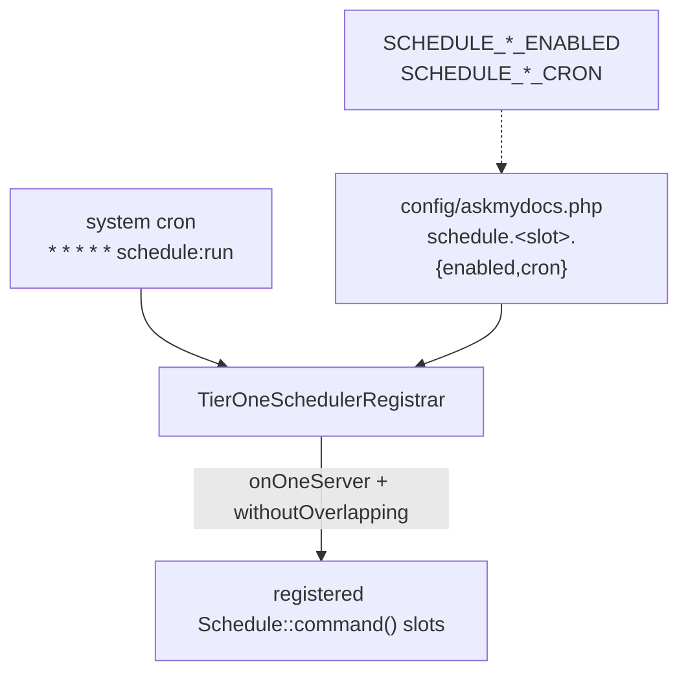

## Motivation

A knowledge base accretes cruft: soft-deleted rows past retention, stale
embedding-cache entries, orphan files on disk, archived document versions,
failed jobs. Left alone, storage grows without bound and the graph drifts from
the markdown. AskMyDocs ships a **config-driven scheduler** that runs the
retention sweeps, rebuilds the canonical graph, and computes daily insights —
each slot independently toggleable and re-timeable without touching code.

## Design: one cron entry, many config-gated slots

You register **one** system cron line. Everything else is data:

```cron
* * * * * cd /path/to/AskMyDocs && php artisan schedule:run >> /dev/null 2>&1
```

`bootstrap/app.php` `->withSchedule()` delegates to
`App\Scheduling\TierOneSchedulerRegistrar`, which walks a fixed slot list and
reads each slot's **cron** and **enabled flag** from
`config('askmydocs.schedule.<slot>')`. Every registration is hardened with
`onOneServer()` (one host fires it in a cluster) and `withoutOverlapping()` (a
long run never collides with the next tick).



Each slot reads two env vars: `SCHEDULE_<SLOT>_ENABLED` (default `true`) and
`SCHEDULE_<SLOT>_CRON` (a default cron string). Set the enabled flag to `false`
to disable a slot, or override the cron to re-time it — no deploy required.

## The scheduled slots

Defaults from `config/askmydocs.php`. Times are UTC unless your `APP_TIMEZONE`
says otherwise.

| Cron | Command | Slot env prefix |
|---|---|---|
| `10 3 * * *` | `kb:prune-embedding-cache` | `SCHEDULE_KB_PRUNE_EMBEDDING_CACHE_*` |
| `20 3 * * *` | `chat-log:prune` | `SCHEDULE_CHAT_LOG_PRUNE_*` |
| `30 3 * * *` | `kb:prune-deleted` | `SCHEDULE_KB_PRUNE_DELETED_*` |
| `40 3 * * *` | `kb:rebuild-graph` | `SCHEDULE_KB_REBUILD_GRAPH_*` |
| `50 3 * * *` | `kb:health-recompute` | `SCHEDULE_KB_HEALTH_RECOMPUTE_*` |
| `55 3 * * *` | `kb:stale-review-sweep` | `SCHEDULE_KB_STALE_REVIEW_SWEEP_*` |
| `0 4 * * *` | `queue:prune-failed --hours=48` | `SCHEDULE_QUEUE_PRUNE_FAILED_*` |
| `0 4 * * *` | `widget:prune-sessions` | `SCHEDULE_WIDGET_PRUNE_SESSIONS_*` |
| `10 4 * * *` | `notifications:prune` | `SCHEDULE_NOTIFICATIONS_PRUNE_*` |
| `10 4 * * *` | `ai-act:regulatory-poll` | `SCHEDULE_AI_ACT_REGULATORY_POLL_*` |
| `20 4 * * *` | `kb:prune-archived-versions` | `SCHEDULE_KB_PRUNE_ARCHIVED_VERSIONS_*` |
| `30 4 * * *` | `admin-audit:prune` | `SCHEDULE_ADMIN_AUDIT_PRUNE_*` |
| `40 4 * * *` | `kb:prune-orphan-files --dry-run` | `SCHEDULE_KB_PRUNE_ORPHAN_FILES_*` |
| `40 4 * * *` | `kb:wiki-maintain` | `SCHEDULE_KB_WIKI_MAINTAIN_*` |
| `50 4 * * *` | `admin-nonces:prune` | `SCHEDULE_ADMIN_NONCES_PRUNE_*` |
| `0 5 * * *` | `insights:compute` | `SCHEDULE_INSIGHTS_COMPUTE_*` |
| `30 5 * * *` | `eval:nightly` | `SCHEDULE_EVAL_NIGHTLY_*` |
| `0 7 * * 1` | `notifications:digest-weekly` | `SCHEDULE_NOTIFICATIONS_DIGEST_WEEKLY_*` |
| `0 6 1 1,4,7,10 *` | `compliance:digest-quarterly` | `SCHEDULE_COMPLIANCE_DIGEST_QUARTERLY_*` |

<Note>
`kb:prune-orphan-files` is scheduled with `--dry-run` by default — it
*reports* orphans nightly without deleting. Run it manually without `--dry-run`
once you have reviewed the report. Two slots carry an **extra upstream gate** on
top of their `SCHEDULE_*` toggle: `eval:nightly` honours `EVAL_NIGHTLY_ENABLED`,
and `ai-act:regulatory-poll` is only registered at all when
`AI_ACT_REGULATORY_FEED_ENABLED=true` (a composite gate in `bootstrap/app.php`) —
when that env is false the slot never runs regardless of its `SCHEDULE_*` value.
</Note>

## What the maintenance commands do

- **`kb:prune-embedding-cache`** — evict `embedding_cache` rows older than
  `KB_EMBEDDING_CACHE_RETENTION_DAYS` (LRU by `last_used_at`). Returns early
  when `--days=0`. **Not** a full flush — see the
  [dimension gotcha](/troubleshooting#embedding-dimension-gotcha).
- **`kb:prune-deleted`** — hard-delete documents soft-deleted longer than
  `KB_SOFT_DELETE_RETENTION_DAYS`, cascading chunks + graph + file on disk.
- **`kb:prune-archived-versions`** — drop old archived document versions beyond
  the per-family retention cap.
- **`kb:prune-orphan-files`** — remove markdown files on the KB disk with no
  matching `knowledge_documents` row.
- **`kb:rebuild-graph`** — rebuild `kb_nodes` + `kb_edges` from canonical docs.
  No-op when no canonical docs exist. See [canonical & promotion](/canonical-and-promotion).
- **`kb:health-recompute`** / **`kb:stale-review-sweep`** — recompute KB health
  snapshots; flag documents past the staleness window for reviewer notification.
- **`chat-log:prune`** / **`notifications:prune`** / **`admin-audit:prune`** /
  **`admin-nonces:prune`** / **`widget:prune-sessions`** — retention sweeps for
  their respective tables.
- **`insights:compute`** — the daily AI-insights snapshot (one row per tenant).
- **`eval:nightly`** — the eval-harness regression run; alerts on `macro_f1`
  drop.

Most accept `--days=N` (override the retention window; `0` disables that
rotation), `--tenant=` (scope to one tenant), and `--dry-run`. See the command
usage in [self-hosting](/self-hosting).

## Worked example: re-time and disable slots in production

Move the graph rebuild to 02:15, and turn off the weekly digest entirely:

```bash
# .env
SCHEDULE_KB_REBUILD_GRAPH_CRON="15 2 * * *"
SCHEDULE_NOTIFICATIONS_DIGEST_WEEKLY_ENABLED=false
```

```bash
php artisan config:clear           # reload the cron map
php artisan schedule:list          # verify the new timing + that the digest is gone
```

`schedule:list` prints the resolved schedule — use it to confirm overrides
landed before trusting the next tick.

## Gotchas & operations

- **Register the cron line once.** Forgetting `* * * * * schedule:run` means
  *nothing* runs — there is no fallback timer.
- **`onOneServer` needs a shared cache/lock store.** In a multi-node cluster,
  point `CACHE_STORE` at a shared backend (database/redis) or every node fires
  every slot.
- **`config:clear` after editing `SCHEDULE_*`.** A cached config keeps the old
  cron.
- **`--dry-run` first for destructive sweeps.** `kb:prune-orphan-files` ships
  dry-run on the schedule; keep it that way until you have audited the report.

<CardGroup cols={2}>
  <Card title="Self-hosting" icon="server" href="/self-hosting">
    Wire the cron + worker into your process manager.
  </Card>
  <Card title="Troubleshooting" icon="wrench" href="/troubleshooting">
    Diagnose stalled queues, retention, and health.
  </Card>
</CardGroup>
