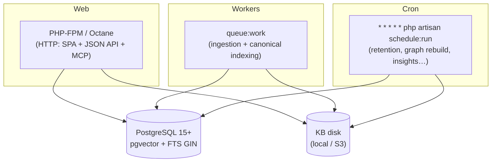

## Motivation

AskMyDocs is **self-hostable and MIT-licensed** — your knowledge base, your
embeddings, your audit trail, on your own infrastructure. There is no managed
control plane and no phone-home: the only outbound calls are to the AI provider
you configure. This page takes a bare Linux host (or container) to a running
instance.

## Requirements

| Component | Minimum | Notes |
|---|---|---|
| PHP | `>= 8.3` | with the usual Laravel extensions (`pdo_pgsql`, `mbstring`, `openssl`, …) |
| Composer | `2.x` | dependency manager |
| PostgreSQL | `>= 15` | with the **`pgvector`** extension |
| Node.js | `>= 20` | only to build the Vite SPA |
| npm | bundled with Node | |

PostgreSQL with `pgvector` is **not optional** — the vector similarity search
and the FTS GIN index are core to retrieval. SQLite is used only in the test
suite (where `vector(N)` columns swap to JSON text).

## The runtime topology

A production instance is three long-lived process groups plus the database:



The web tier answers requests; the **queue worker** runs ingestion +
canonical-indexing jobs (`IngestDocumentJob`, `CanonicalIndexerJob`); the
**scheduler** runs nightly retention, graph rebuild, and insight computation.

## Install — step by step

<Steps>
  <Step title="Clone & install dependencies">
    ```bash
    git clone https://github.com/lopadova/AskMyDocs.git
    cd AskMyDocs
    composer install --no-dev --optimize-autoloader
    ```
  </Step>
  <Step title="Environment file + app key">
    ```bash
    cp .env.example .env
    php artisan key:generate
    ```
    Set `APP_URL`, the `DB_*` block, your `AI_PROVIDER` + `*_API_KEY`, and
    `KB_EMBEDDINGS_DIMENSIONS` to match your embeddings model. See
    [Configuration](/configuration).
  </Step>
  <Step title="Enable pgvector & migrate">
    Create the database, then enable the extension once:
    ```sql
    CREATE EXTENSION IF NOT EXISTS vector;
    ```
    ```bash
    php artisan migrate --force
    ```
    The migrations create every table, the pgvector columns, and the FTS GIN
    index. See the [core concepts](/core-concepts).
  </Step>
  <Step title="Seed roles (RBAC)">
    Seed the Spatie roles + permissions so you can sign in to the admin SPA:
    ```bash
    php artisan db:seed
    php artisan auth:grant you@example.com super-admin
    ```
  </Step>
  <Step title="Build the SPA">
    ```bash
    npm ci
    npm run build           # tsc + vite build (app + embeddable widget)
    ```
    `npm run build` compiles the React admin/chat SPA **and** the embeddable
    KITT widget bundle.
  </Step>
  <Step title="Run the worker & scheduler">
    Point a process manager (systemd, Supervisor) at the worker, and add the
    scheduler to cron:
    ```bash
    php artisan queue:work --queue=kb-ingest,default --tries=3
    ```
    ```cron
    * * * * * cd /path/to/AskMyDocs && php artisan schedule:run >> /dev/null 2>&1
    ```
    See [Scheduler & maintenance](/scheduler-and-maintenance).
  </Step>
</Steps>

## Storage: the KB disk

Canonical markdown is the **source of truth**; the database is a projection
rebuildable from it. The KB disk is configured in `config/filesystems.php` and
selected via env:

```bash
KB_FILESYSTEM_DISK=kb       # the logical disk name
KB_DISK_DRIVER=local        # local | s3
KB_PATH_PREFIX=             # optional prefix every path is resolved under
KB_RAW_DISK=kb-raw          # raw (pre-conversion) source retention
```

For an S3-backed disk, set the standard `AWS_*` credentials and switch
`KB_DISK_DRIVER=s3`. Every path is normalised through `App\Support\KbPath` so the
ingest and delete flows resolve identically.

## Queue connection

Ingestion is asynchronous by default. For anything beyond a single-node demo,
use a real queue:

```bash
QUEUE_CONNECTION=database    # or redis
KB_INGEST_QUEUE=kb-ingest
KB_INGEST_DEFAULT_PROJECT=default
```

With `QUEUE_CONNECTION=sync`, ingestion runs inline in the request — fine for a
laptop, wrong for production (a 100-document batch would block the HTTP call).

## Worked example: a minimal single-node deploy

```bash
# 1. dependencies
composer install --no-dev -o && npm ci && npm run build

# 2. database
sudo -u postgres psql -c "CREATE DATABASE askmydocs;"
sudo -u postgres psql -d askmydocs -c "CREATE EXTENSION IF NOT EXISTS vector;"
php artisan migrate --force && php artisan db:seed --force

# 3. first admin
php artisan auth:grant ops@acme.com super-admin

# 4. ingest a folder of docs
php artisan kb:ingest-folder docs/ --project=handbook

# 5. processes (Supervisor program + cron entry)
php artisan queue:work --queue=kb-ingest,default --tries=3
# cron: * * * * * php artisan schedule:run
```

## Gotchas & operations

- **pgvector must exist before `migrate`.** A missing extension fails the
  `vector(N)` column creation with a Postgres error.
- **The dimension is a contract.** `KB_EMBEDDINGS_DIMENSIONS` must equal your
  embeddings model's output width at `migrate` time. Changing it later means a
  resize migration + cache flush + re-index
  ([gotcha](/troubleshooting#embedding-dimension-gotcha)).
- **`sync` queue is not for production.** Use `database` or `redis` and a
  supervised worker.
- **Cache config in production.** `php artisan config:cache route:cache` — and
  `config:clear` after any `.env` change.
- **Health-check the deploy.** `GET /healthz` returns `ok`; the admin dashboard
  health panel surfaces DB / pgvector / queue / disk / provider status
  ([troubleshooting](/troubleshooting#health-checks)).

<CardGroup cols={2}>
  <Card title="Configuration" icon="sliders" href="/configuration">
    Every knob, layered env → config → service.
  </Card>
  <Card title="Scheduler & maintenance" icon="clock" href="/scheduler-and-maintenance">
    The nightly jobs that keep storage tidy.
  </Card>
</CardGroup>
