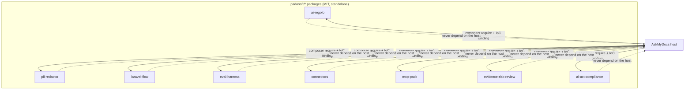

## Motivation

AskMyDocs is assembled from focused, **standalone** packages rather than a
monolith. Every `padosoft/*` package is MIT-licensed, carries architecture tests
enforcing **standalone-agnostic** invariants (zero references to AskMyDocs models
/ tables in `src/`), and is `composer require`-able into any Laravel app. AskMyDocs
*uses* them; they never depend on AskMyDocs.

## The ecosystem

| Package | Role |
|---|---|
| `padosoft/laravel-ai-regolo` | Regolo provider for `laravel/ai` (EU OpenAI-compatible) — see [AI providers](/ai-providers). |
| `padosoft/laravel-ai-finops` (+ `-admin`) | Cross-provider AI-spend governance metered natively on the `laravel/ai` SDK — see [AI FinOps](/ai-finops). |
| `padosoft/laravel-ai-guardrails` (+ `-admin`) | AI safety firewall enforced on the live chat path — input screening + output sanitization — see [AI Guardrails](/ai-guardrails). |
| `padosoft/laravel-pii-redactor` (+ `-admin`) | PII detection + redaction, EU country packs, 6 detectors, 4 strategies — see [PII & compliance](/pii-and-compliance). |
| `padosoft/laravel-flow` (+ `-admin`) | In-process saga / compensation engine + approval gates + webhook outbox + replay. |
| `padosoft/eval-harness` (+ `-ui`) | RAG / LLM evaluation — golden datasets, metrics, cohorts, adversarial lane, LLM-as-judge. |
| `padosoft/askmydocs-connector-*` (8 pkgs) | The connector framework + 7 native connectors — see [Connectors](/connectors). |
| `padosoft/askmydocs-mcp-pack` (+ `-admin`) | Framework-agnostic MCP plumbing — see [MCP server](/mcp-server). |
| `padosoft/laravel-evidence-risk-review` (+ `-admin`) | Answer-grounding risk firewall — see [Evidence & Risk Review](/evidence-risk-review). |
| `padosoft/laravel-ai-act-compliance` (+ `-admin`) | EU AI Act pack — DSAR, bias monitoring, risk register, consent/disclosure. |

<Note>
**Platform on `laravel/ai` 0.8 (since v8.19).** The packages that touch the AI SDK
in code — `laravel-ai-regolo` (v1.2.1) and `laravel-ai-finops` (v1.4.0) — were each
released onto `laravel/ai` **^0.8** before the host bumped `^0.6.8 → ^0.8.1` in one
coherent resolve. `laravel-ai-guardrails` is born on `^0.8`. The whole stack runs on
a single SDK line — no version skew ([ADR 0016](/architecture/decisions)).
</Note>

## How they integrate

Each package talks to AskMyDocs only through a host-bound **IoC contract** (e.g.
`ConnectorIngestionContract`, `EvidenceReviewerLlmContract`, the MCP host bridge).
The host implements the contract with the real retrieval / RBAC / audit; the
package stays ignorant of AskMyDocs.

## Why standalone

- **Community reuse** — anyone can `composer require` a single package into a
  fresh Laravel app and get a working in-process feature.
- **Independent testing + releasing** — each ships its own CI matrix (PHP
  8.3/8.4/8.5 × Laravel 13) and SemVer tags on Packagist.
- **Clean boundaries** — the standalone-agnostic architecture test fails the
  build if a package ever reaches into the host.

<CardGroup cols={2}>
  <Card title="MCP server" icon="terminal" href="/mcp-server">
    The MCP pack in action.
  </Card>
  <Card title="Connectors" icon="plug" href="/connectors">
    The connector-package family.
  </Card>
</CardGroup>
