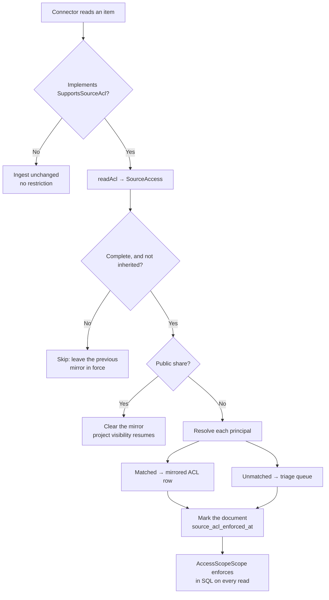

## The problem ingestion created

Every connector reads files from a system that already has an opinion about
who may see them. Drive knows a document is shared with three people.
SharePoint knows a library is restricted to a department. A mailbox is, by
construction, one person's.

Ingestion used to discard all of it. The connector fetched the bytes, the
document was written into a project, and from that moment the only gate was
project membership — a far coarser boundary than the one the source was
enforcing a second earlier. A file shared with three people became readable
by everyone with access to the project it landed in, and worse, it became
*retrievable*: the RAG pipeline would ground an answer in it and cite it, to
someone the source had never granted anything.

Nobody had to make a mistake for this to happen. It was the default
behaviour of a correct-looking ingest.

## What phase 2 does

The connector reports the source's permission list. The host resolves that
list against its own directory, mirrors what it can onto the document as
ACL rows, and enforces the result in the retrieval path. What it cannot
resolve, it queues for a person.



Two properties carry most of the weight, and both concern what happens when
the source says *less* than it did last time.

### Mirroring and reconciliation are the same operation

A mirror that only ever adds rows is worse than no mirror at all. Revoke a
share upstream and the grant stays here forever — and because it now looks
like a deliberate permission, nobody questions it. So every pass replaces
the mirrored set wholesale: rows the source no longer names are deleted in
the same transaction that writes the ones it does.

Rows an operator created by hand are never touched. An operator's grant is
not the source's to withdraw, and deleting one because upstream stopped
mentioning it is the same bug pointed the other way.

### Not knowing is never treated as knowing

A permission list can fail to arrive in several ways that all look like an
empty list if you are careless: the API truncated it, the call was
rate-limited, the item inherits from a folder, the payload failed to decode.
None of those are permission lists. Acting on one would either revoke access
because a request failed, or grant it because of a bug.

`SourceAccess` therefore separates three states that a naive design
collapses into one:

| State | Meaning | What the host does |
|---|---|---|
| `of([...])` | The source answered in full | Mirror exactly these principals |
| `of([])` | The source says **nobody** | Restrict to nobody — a real fact |
| `unknown()` | We could not find out | Leave the previous mirror in force |
| `inherited()` | "As the parent says" | Leave the previous mirror in force |

`of([])` and `unknown()` differ by one boolean and by everything that
matters. The first means a share was removed and the document should stop
being readable; the second means a request failed and nothing should change.

## Restriction is recorded on the document

The obvious implementation infers "this document is restricted" from the
presence of mirrored ACL rows. It is wrong, and wrong in the dangerous
direction.

A source can report a complete permission list naming only people this
application cannot place: an external collaborator, a contractor, a group
with no internal counterpart. That is a **complete** list, and it produces
**zero** mirrored rows. Reading "no rows" as "no restriction" would leave
exactly those documents open to the whole project — the ones whose readers
are least likely to be colleagues.

So the fact lives in `knowledge_documents.source_acl_enforced_at`. Null
means no source has ever spoken for the document, which is every document
that predates this feature and every corpus whose connectors do not read
permissions.

## Enforcement lives in SQL, not only in the policy

This is rule R33 in the repository, and it exists because the same mistake
has now been made three times.

`KnowledgeDocumentPolicy` is the authoritative per-row check, and it is
consulted by controllers. It is **not** consulted by retrieval: the RAG path
resolves chunks with `KnowledgeChunk::whereHas('document', …)` and never
calls the Gate. An authorization arm implemented only in the policy is
therefore not enforced for grounding — the model receives the chunks and
cites them.

The mirrored-permission arm is enforced in `AccessScopeScope`, the global
scope every document query passes through:

```php
$builder->where(function ($outer) use ($model, $idColumn, $user, $roleNames) {
    // The overwhelmingly common branch: no source has ever spoken for this
    // document. A plain NULL check on an indexed column.
    $outer->whereNull($model->qualifyColumn('source_acl_enforced_at'))
        ->orWhereExists(function ($sub) use ($idColumn, $user, $roleNames) {
            $sub->from('knowledge_document_acl as granted')
                ->whereColumn('granted.knowledge_document_id', $idColumn)
                ->where('granted.permission', 'view')
                ->where('granted.effect', 'allow')
                // …matching this user, or any role they hold
                ->selectRaw('1');
        });
});
```

The subquery looks for **any** allow, not only a mirrored one, so an
operator resolving a triage entry with an ordinary ACL row is enough on its
own. Users who can read every project return from the scope before this
code runs, so oversight roles are unaffected.

## The triage queue

Unresolved principals are the normal case, not an error condition. An
external collaborator, a group address, a domain-wide share — a healthy
corpus produces plenty.

The dangerous thing to do with them is nothing. Dropping an unresolved
principal silently narrows the mirrored list below what the source said, so
somebody with legitimate upstream access loses it here and nobody finds out,
because a missing grant looks exactly like a share that was never made.

So they are recorded, and a person decides. Entries hold a question, never a
permission: nothing in the queue grants anything, and answering one means
creating an ordinary ACL row — a separate, deliberate act. That separation
is what keeps a one-click triage screen from quietly becoming a one-click
access-granting screen.

Entries survive across syncs with their status intact, so a principal an
operator has already dismissed is not re-asked every time; entries the
source stops naming are removed, because the question is no longer being
asked.

## Three surfaces, one core

Per rule R44, the capability is reachable from all three surfaces, each a
thin layer over `SourceAclTriageService`:

```bash
# CLI
php artisan kb:source-acl --status=pending --project=engineering
php artisan kb:source-acl --ignore=42
```

```http
GET   /api/admin/kb/source-acl?status=pending
PATCH /api/admin/kb/source-acl/{id}    {"status": "ignored"}
```

The MCP tool `KbSourceAclTool` is **read-only, and deliberately so**. It can
report that a question is outstanding; it cannot answer one. Granting a
person access to documents is exactly the class of decision ADR 0023/0024
keeps outside the agent trust boundary.

## Decision rationale

**Why the ingestion contract was not extended.** The natural design adds an
optional `?SourceAccess $access = null` parameter to `dispatchIngestion()`,
and ADR 0028 originally prescribed it as the non-breaking option. It is not.
PHP rejects an implementation declaring fewer parameters than its interface,
optional or not, so every **host** implementing the contract would fatal at
class-declaration time on upgrade — before a line of its own code ran.
Connectors are callers and would have been fine; hosts are implementers and
would not. The list travels in `$metadata` under a reserved key instead,
written by `BaseConnector::withSourceAccess()` so no call site handles the
key by hand.

**Why the mirror runs inside the ingest transaction.** If the permission
mirror cannot be written, the document must not exist either. Ingesting it
anyway would publish to the whole project a file the source shared with
three people. A failed ingest retries; an over-shared document does not
announce itself.

**Why groups and domains are not guessed.** Mapping an upstream group to an
internal role needs a directory link this application does not have.
Inferring one from the name would grant on a string coincidence — an
upstream group called `editors` is not this application's `editor` role.

**Why the capability is opt-in.** Eleven connectors and a public template
consume the ingestion contract. Reading ACLs is expensive, rate-limited, and
impossible for some sources. A connector that does not implement
`SupportsSourceAcl` behaves exactly as it does today.

## Gotchas

- **A document restricted to nobody is not a bug.** A complete empty list
  means the share was removed upstream. The document stays in the corpus and
  remains visible to oversight roles; it simply stops being retrievable by
  project members.
- **Re-ingesting identical bytes still reconciles permissions.** Content
  idempotency and permission freshness are different concerns; a sync that
  changes only sharing must still take effect.
- **The mirror asserts read permissions only.** `view` is the sole
  permission it writes, because that is what the source described. Inferring
  an editing restriction from it would be inventing a fact.
- **Counting mirrored ACL rows is not a measure of restricted documents.**
  Use `source_acl_enforced_at`; see the section above for why.

## Related

- [Ingest Provenance](/ingest-provenance) — ADR 0028 phase 1, which records
  *who authored* content, and which this phase builds on.
- ADR 0028 in `docs/adr/` — source ACL mirroring and ingest-time provenance.
- ADR 0023 / 0024 — the agent trust boundary that keeps the MCP surface
  read-only.
