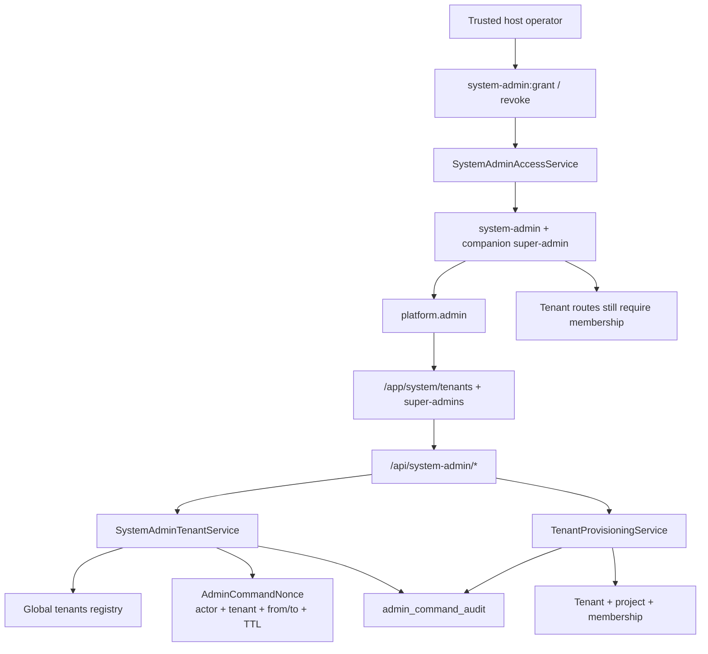

## Motivation

“Super admin” often means two different things. A person may be the maximum
administrator of three companies without being allowed to discover a fourth
customer. A platform operator, by contrast, must recover suspended tenants,
provision new companies and inspect the registry without depending on a current
tenant membership.

AskMyDocs models those identities separately:

| Role | Scope | How scope is obtained |
|---|---|---|
| `system-admin` | Global control plane | Protected operator grant; owns `platform.admin` |
| `super-admin` | Maximum application privilege inside membership tenants | Project membership plus the tenant role |
| `admin`, `dpo`, `editor`, `viewer` | Existing scoped responsibilities | Project membership |

Spatie teams are deliberately disabled. An identity's application role is
global, while membership determines *where* it may act. A `system-admin` also
holds companion `super-admin`, allowing existing tenant routes to keep their
tested `role:admin|super-admin` boundary.

## Architecture



The browser route is not nested under `/app/{teamHash}`. The API interceptor
does not send `X-Tenant-Id` to `/api/system-admin/*`; services instead constrain
every projects/memberships join with the explicit target slug. This is what
keeps the control plane usable when a tenant is suspended or archived, and
when the System Admin has no operational membership at all.

## Bootstrap and protected role lifecycle

Create the account through the normal identity workflow, seed RBAC, then grant
platform authority from a trusted console:

```bash
php artisan db:seed --class=RbacSeeder --force
php artisan system-admin:grant ops@example.com --yes
```

Interactive use may omit `--yes`; the command defaults the confirmation to
“no”. Non-interactive use without `--yes` fails closed.

```bash
php artisan system-admin:revoke ops@example.com --yes
```

Revoke retains `super-admin`, because that identity may still administer its
membership tenants. It refuses inactive/deleted targets and refuses to remove
the final active system administrator. A successful role mutation and its audit
completion share one database transaction; an audit failure rolls the role
change back.

The following paths always reject `system-admin`:

- Users and Roles CRUD;
- `auth:grant` and `demo:seed-user`;
- invitation grants, including stored legacy grants;
- tenant provisioning.

## Global tenant API

Every endpoint requires Sanctum authentication and `can:platform.admin`. The
old `/api/super-admin/tenants` namespace does not exist.

| Method | Path | Contract |
|---|---|---|
| `GET` | `/api/system-admin/tenants` | Paginated operational registry; `search`, `status`, `page`, `per_page` |
| `POST` | `/api/system-admin/tenants/availability` | Read-only slug, identity and requested-role preflight; email stays in JSON body |
| `POST` | `/api/system-admin/tenants` | Atomic tenant, initial project, identity/attach and membership |
| `GET` | `/api/system-admin/tenants/{slug}` | Tenant detail plus paginated membership users and effective access |
| `POST` | `/api/system-admin/tenants/{slug}/lifecycle-preview` | One-time token for one exact status transition |
| `PATCH` | `/api/system-admin/tenants/{slug}` | Rename and/or confirmed lifecycle change |
| `GET` | `/api/system-admin/super-admins` | Read-only paginated/filterable global roster |
| `GET` | `/api/system-admin/super-admins/{user}/tenants` | Paginated tenant associations for one Super Admin |

The optional tenant registry missing path is a clean
`503 tenant_registry_unavailable`, never a partial response.

## Provisioning semantics

New identities may start as tenant `super-admin`, `admin`, `editor` or
`viewer`. The temporary password is generated with Web Crypto in the browser;
if secure randomness is unavailable, submission fails closed. Passwords and
confirmation tokens never enter audit arguments.

Existing identities are attached without changing their password or roles.
Their effective global tenant role must already satisfy the requested role:

```text
super-admin > admin > editor > viewer
```

An insufficient role returns `422 role_global_mismatch`. This avoids a
seemingly local onboarding action silently promoting the identity across every
tenant where it already has membership.

The normalized identity key is database-unique. Its deployment migration adds
the nullable companion column, backfills with `chunkById(100)`, reports bounded
hash-and-id collision diagnostics, then creates the unique index. A stopped
collision migration can be rerun after remediation.

## Lifecycle confirmation and audit

Changing `active`, `suspended` or `archived` status requires a fresh preview.
The server returns the plaintext token once and stores only SHA-256. The nonce
is bound to:

- the authenticated actor;
- tenant slug;
- current status;
- requested status;
- a five-minute expiry.

`PATCH` locks and consumes the nonce in the same transaction as the tenant
mutation and completed audit update. Reuse, expiry, actor mismatch and state
drift all return 422. Rename alone needs no lifecycle token.

Audit arguments contain the actor id, explicit target tenant, before/after
metadata and optional `X-Request-Id` correlation id. Provisioning hashes the
target email rather than storing it in the audit payload.

## Decision rationale

- **A capability, not a primary-role string, gates the API.** `platform.admin`
  is the server authority; `/api/auth/me` exposes additive
  `features.system_admin` only for UI discovery.
- **Companion role instead of hundreds of changed allowlists.** Existing tenant
  routes remain tenant-role surfaces. The companion invariant is centralized in
  migration, seeding and the protected grant service.
- **Preserve legacy authority during deployment.** The migration copies
  existing `super-admin` assignments before removing their global permissions.
  Operators then deliberately revoke excess migrated system roles.
- **No MCP global write surface.** Granting platform privilege or changing a
  tenant lifecycle is outside the agent trust boundary. This is the explicit
  R44 exception in [ADR 0023](https://github.com/lopadova/AskMyDocs/blob/main/docs/adr/0023-v830-system-admin-boundary.md).

## Operations and gotchas

- After upgrading, review every migrated system administrator; the migration is
  conservative to avoid accidental lockout.
- A tenant `super-admin` without membership receives 403 from a foreign
  `X-Tenant-Id` and from the global API.
- A `system-admin` without membership can use the global API but receives
  `403 tenant_forbidden` from operational tenant routes.
- `/api/auth/me.teams` contains active membership tenants only; `default` is
  not implicit.
- The reserved `system-registration` row is technical infrastructure for public
  invite lookup. It is hidden from the global operational registry as well as
  tenant switchers.
- Suspended/archived tenants disappear from normal switchers but remain in the
  system registry.
- Generate a new lifecycle preview after any status change; old tokens are
  intentionally unusable.
- Never repair access with direct `model_has_roles` inserts. Follow the
  [system-admin recovery runbook](https://github.com/lopadova/AskMyDocs/blob/main/docs/runbooks/system-admin-recovery.md).

See also: [Team and tenant management](/team-management),
[multi-tenant isolation](/multi-tenant-isolation), and
[security and threat model](/architecture/security-and-threat-model).
