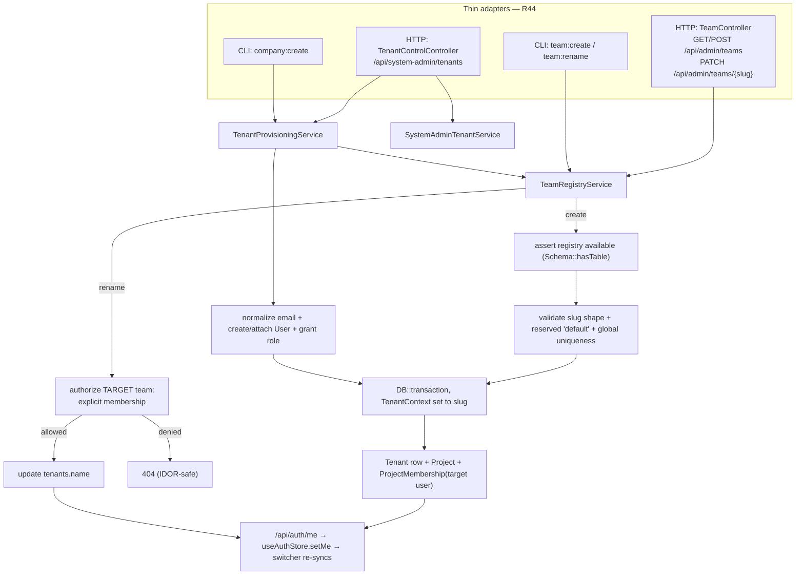

## Motivation

A [team is a tenant](/multi-tenant-isolation): a `tenant_id` slug that scopes
every Eloquent query (R30/R31). The [team switcher](/team-switcher) lets a user
*move between* the teams they already belong to, and reads each team's display
**name** from the `tenants` registry row. There are now two deliberately
different administration surfaces:

- **Administration → Teams** is tenant-local and available to `admin` and
  `super-admin`. It creates a team for the acting administrator and renames teams
  they may administer.
- **System administration → Tenant control** is global and visible only with
  `platform.admin` (the protected `system-admin` role). It lists every registry
  tenant (including suspended/archived), expands one tenant's users and access,
  updates lifecycle state, and provisions a tenant + initial project +
  new/existing user in one operation.

This split keeps ordinary tenant administrators inside their own boundary while
giving platform operators the fast SaaS onboarding path they need.

## What a "team" is here

There is **no host `Team` model and no host `teams` table**. A team is the
`tenant_id` string stamped on every tenant-aware row; its editable display
**name** lives on an **optional** vendor row — the `tenants` table shipped by
`padosoft/laravel-ai-act-compliance` (`Padosoft\AiActCompliance\MultiTenancy\Models\Tenant`).
That is the very table [`UserTeamsResolver`](/team-switcher) reads for switcher
labels, so team management writes to exactly the source the switcher displays.

The `default` slug is retained for legacy data compatibility. It is **not** an
implicit tenant: it appears in the switcher and tenant-local administration
only when the identity has an explicit `project_memberships` row for it. It
remains reserved — never creatable and never renamable.

## Design



**The pieces**

| Piece | Path | Responsibility |
|---|---|---|
| `TeamRegistryService` | `app/Services/Admin/TeamRegistryService.php` | The single shared core: `manageableTeams`, `create`, `rename` — all validation, authorization and write ordering |
| `TenantProvisioningService` | `app/Services/Admin/TenantProvisioningService.php` | Atomic company onboarding shared by HTTP and `company:create`; preflight, normalized-email identity, create/attach, role and initial membership |
| `SystemAdminTenantService` | `app/Services/Admin/SystemAdminTenantService.php` | Global paginated registry, tenant detail, lifecycle preview, single-use confirmation and audited updates |
| `TeamController` | `app/Http/Controllers/Api/Admin/TeamController.php` | Thin HTTP adapter; maps the unavailable-registry exception to 503 |
| `TenantControlController` | `app/Http/Controllers/Api/SystemAdmin/TenantControlController.php` | `platform.admin`-gated global HTTP adapter |
| Routes | `routes/api.php` | `apiResource('teams')` (index/store/update) in the `role:admin\|super-admin` admin group, bound by `slug` |
| Global routes | `routes/api.php` | `/api/system-admin/tenants` under `can:platform.admin`; intentionally independent of `X-Tenant-Id` |
| `team:create` / `team:rename` | `app/Console/Commands/{CreateTeamCommand,RenameTeamCommand}.php` | CLI adapters over the same core |
| `company:create` | `app/Console/Commands/CreateCompanyCommand.php` | Operator adapter over `TenantProvisioningService`, preserving the registry-less bootstrap path |
| `TeamsList` + `TeamFormDialog` | `frontend/src/features/admin/teams/*` | The admin page + create/rename modal; re-syncs the switcher after a mutation |
| `TenantControlView` + provisioning dialog | `frontend/src/features/system-admin/tenants/*` | Global tenant table, access detail, status editor and one-submit onboarding at `/app/system/tenants` |
| `TeamRegistryUnavailableException` | `app/Services/Admin/Exceptions/…` | Typed exception → HTTP 503 when the `tenants` table is absent |

## Data model

The team's editable name is the `name` column of the vendor `tenants` table:

| Column | Notes |
|---|---|
| `slug` | `varchar(50)`, globally UNIQUE — **is** the `tenant_id`; immutable |
| `name` | `varchar(200)` — the editable display name the switcher shows |
| `status` | `active \| suspended \| archived` (create sets `active`) |

Creating a team also writes a `projects` row (`tenant_id`=slug, an initial
`project_key`) and a `project_memberships` row for the acting user — the same
ordering `company:create` uses, so the new team is immediately usable and appears
in the creator's switcher.

Account identity remains global rather than tenant-scoped. `users.email` is
stored lower-cased and mirrored into the database-unique `email_normalized`
column, including soft-deleted accounts. This makes `Owner@Acme.it` and
`owner@acme.it` the same identity under PostgreSQL as well as SQLite/MySQL and
closes the concurrent duplicate-creation race.

## System-admin tenant control

Open **System administration → Tenant control** while signed in with the
protected `system-admin` role. The UI keys visibility from
`features.system_admin`; the API remains authoritative with
`can:platform.admin`. A tenant `super-admin` without that permission receives
403 and cannot enumerate the registry.

### Registry and detail

`GET /api/system-admin/tenants` is paginated (`page`, `per_page`, maximum 100)
and supports `search` plus `status=active|suspended|archived`. Each row includes
project and distinct-user counts. Selecting a tenant calls
`GET /api/system-admin/tenants/{slug}` and returns a paginated user list with:

- global Spatie roles and all effective permissions;
- active, inactive or soft-deleted account state;
- whether the user has all-project access under the current isolation mode;
- every membership in the selected tenant, with project key, membership role
  and scope allowlist.

The global endpoint deliberately ignores the active team header: the registry is
the resource being administered. The browser therefore never sends
`X-Tenant-Id` to `/api/system-admin/*`; every join into projects/memberships is
instead constrained explicitly by the target tenant slug.

### One-step provisioning

The **Provision tenant** dialog performs a debounced preflight against
`POST /api/system-admin/tenants/availability` with company, slug, email and
requested role as soon as the fields are valid:

1. a taken slug disables submission;
2. a new email reveals name + generated temporary password;
3. an existing active email switches automatically to **associate existing**,
   hides the password field and promises not to change the current password;
4. inactive and soft-deleted identities are blocked with an instruction to
   activate/restore them first.

One `POST /api/system-admin/tenants` then commits the tenant row, initial project,
identity (when new), selected global role and target-tenant membership in a
single transaction. Supported initial roles are tenant `super-admin`, `admin`,
`editor` and `viewer`; `system-admin` is always rejected.
After a new-account success the UI keeps the temporary password visible and can
copy the complete handoff package. Passwords are never returned by the API or
written to logs.

An existing identity is never silently promoted. Its global effective tenant
role must already be at least the requested level
(`super-admin > admin > editor > viewer`), otherwise the API returns
`422 role_global_mismatch` and writes no tenant, project or membership. This is
necessary because Spatie roles apply to the identity across all memberships.

### Lifecycle

`PATCH /api/system-admin/tenants/{slug}` changes the display name and/or lifecycle
status. `suspended` returns HTTP 423 and `archived` returns HTTP 410 on
tenant-scoped requests even when a stale membership still exists. Both states
disappear from the team switcher. Because the global
control plane is not tenant-scoped, a system administrator can always return
the tenant to `active`.

Every status transition first calls
`POST /api/system-admin/tenants/{slug}/lifecycle-preview`. The returned token is
stored only as a hash, expires after five minutes, is single-use, and is bound to
the actor, tenant and exact `from → to` transition. `PATCH` consumes it under
`lockForUpdate`; replay or state drift returns 422. Rename does not require a
lifecycle token. Successful provisioning and updates commit their
`admin_command_audit` completion atomically with the mutation.

## Decision rationale (ADR-style)

- **Separate platform scope from tenant privilege.** `system-admin` owns only
  `platform.admin`; `super-admin` owns the maximum tenant permission set, and
  both roles need membership before they may use tenant routes. A system
  administrator also holds companion `super-admin` so existing tenant route
  allowlists remain stable once a membership exists.
  [ADR 0023](https://github.com/lopadova/AskMyDocs/blob/main/docs/adr/0023-v830-system-admin-boundary.md)
  records the migration and rejected alternatives.
- **Build over the vendor registry, not a new host table.** The switcher already
  depends on `tenants` for names; a second host-owned name table would fork the
  source of truth. When the table is absent the feature degrades (below) rather
  than duplicating it. The `tenants` table is a **registry**, modelled like
  `User` — it is intentionally **not** tenant-aware and is excluded from
  `TenantIdMandatoryTest` (R30/R31), because its `slug` *is* the tenant id every
  other table references.
- **Rename authorizes the *target* team by membership.** The request's active
  tenant does not prove access to another target. The service independently
  requires a membership in the target team, matching the rule
  [`AuthorizeTenantHeader`](/team-switcher) enforces on every tenant route. A
  team you may not administer returns **404** (IDOR-safe: existence stays
  hidden). System administrators manage non-member tenants only through the
  global control plane.
- **No MCP write tool — a deliberate R44 exception.** Like the
  [project registry](/projects-registry), team management is an admin
  **governance** affordance, not an agent capability: a `tenant_id` is already
  usable as a stored legacy slug without a registry row, and a global *write*
  tool conflicts with the propose-only MCP posture. It ships **HTTP + CLI** only;
  the omission is documented in the controller and here rather than left implicit.
- **`default` is reserved, not implicit.** It may have legacy data without a
  registry row, but an identity still needs an explicit membership. Renaming or
  re-creating it is rejected.

## Worked example

An `admin` who is a member of `acme` opens **Administration → Teams**:

1. `GET /api/admin/teams` returns only active teams represented by the
   identity's memberships. `default` appears only when such a membership
   exists. System administrators also see only their operational memberships
   here; the global tenant roster lives under `/api/system-admin/tenants`.
2. **Create** → name `Globex Corp`. The slug auto-fills to `globex-corp`
   (editable, immutable after). `POST /api/admin/teams` writes the `tenants` row +
   an initial `globex-corp` project + a membership for the admin, atomically.
3. The page refetches `/api/auth/me`; the topbar switcher now lists **Globex
   Corp**, switchable immediately.
4. **Rename** `Globex Corp` → `Globex Corporation`: `PATCH
   /api/admin/teams/globex-corp` updates `tenants.name`; the switcher label
   updates without a reload.
5. A rename of a team the admin does not belong to → the API answers **404**,
   and the row exposes no Rename action in the first place.

Equivalently from the CLI:

```bash
php artisan team:create --name="Globex Corp"        # attaches the first system-admin
php artisan team:rename globex-corp "Globex Corporation"
COMPANY_ADMIN_PASSWORD='temporary-secret' php artisan company:create --company="Contoso" --email="owner@contoso.test"
```

## Gotchas

- **The registry table is optional — the feature degrades, it never 500s.** When
  `Schema::hasTable('tenants')` is false (the AI-Act package was never migrated),
  create/rename raise `TeamRegistryUnavailableException`, which the controller maps
  to a clean **503** with `error: team_registry_unavailable` (R14/R43). The list
  still renders with humanised slug names.
- **The slug is immutable.** It is the `tenant_id` every document, chunk,
  membership and chat log joins to — renaming changes only the display `name`.
  To "rename the id", create a new team and migrate content.
- **Every identity sees only membership teams on tenant surfaces.** This
  includes system administrators. **Create** therefore attaches the acting user
  as a member; global non-member administration belongs exclusively to the
  system control plane.
- **Inactive users cannot authenticate.** Both session login and bearer-token
  issuance require `users.is_active=true`; disabling an account is now an
  effective access-control action rather than a display-only flag.
- **Soft-deleted emails remain reserved.** Restore the account instead of
  creating a second identity. This matches the database uniqueness contract and
  prevents hidden duplicate owners.

See also: [The team switcher](/team-switcher), [The project registry](/projects-registry), [Multi-tenant isolation](/multi-tenant-isolation).
