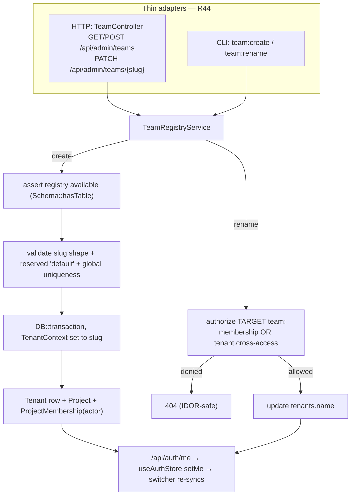

## Motivation

A [team is a tenant](/multi-tenant-isolation): a `tenant_id` slug that scopes
every Eloquent query (R30/R31). The [team switcher](/team-switcher) lets a user
*move between* the teams they already belong to, and reads each team's display
**name** from the `tenants` registry row. But two operator questions were, until
now, answerable only from the CLI:

- **How do I create a new team from the app?** The only path was
  `php artisan company:create`, which also mints a brand-new admin user and is
  deliberately off the HTTP surface.
- **How do I rename a team?** The only HTTP path lived *inside* the AI-Act
  compliance package (`PATCH /api/admin/ai-act-compliance/tenants/{slug}`), gated
  by that package's `viewAiActCompliance` — the wrong home for general team
  governance.

**Team management** closes both gaps with a first-class, native **Teams** admin
page (create + rename) and its CLI + HTTP surfaces, all over one shared core.

## What a "team" is here

There is **no host `Team` model and no host `teams` table**. A team is the
`tenant_id` string stamped on every tenant-aware row; its editable display
**name** lives on an **optional** vendor row — the `tenants` table shipped by
`padosoft/laravel-ai-act-compliance` (`Padosoft\AiActCompliance\MultiTenancy\Models\Tenant`).
That is the very table [`UserTeamsResolver`](/team-switcher) reads for switcher
labels, so team management writes to exactly the source the switcher displays.

The `default` team is the host's "no multi-tenancy" **sentinel**: it has no
`tenants` row and is **reserved** — never creatable, never renamable.

## Design



**The pieces**

| Piece | Path | Responsibility |
|---|---|---|
| `TeamRegistryService` | `app/Services/Admin/TeamRegistryService.php` | The single shared core: `manageableTeams`, `create`, `rename` — all validation, authorization and write ordering |
| `TeamController` | `app/Http/Controllers/Api/Admin/TeamController.php` | Thin HTTP adapter; maps the unavailable-registry exception to 503 |
| Routes | `routes/api.php` | `apiResource('teams')` (index/store/update) in the `role:admin\|super-admin` admin group, bound by `slug` |
| `team:create` / `team:rename` | `app/Console/Commands/{CreateTeamCommand,RenameTeamCommand}.php` | CLI adapters over the same core |
| `TeamsList` + `TeamFormDialog` | `frontend/src/features/admin/teams/*` | The admin page + create/rename modal; re-syncs the switcher after a mutation |
| `TeamRegistryUnavailableException` | `app/Services/Admin/Exceptions/…` | Typed exception → HTTP 503 when the `tenants` table is absent |

## Data model

The team's editable name is the `name` column of the vendor `tenants` table:

| Column | Notes |
|---|---|
| `slug` | `varchar(50)`, globally UNIQUE — **is** the `tenant_id`; immutable |
| `name` | `varchar(200)` — the editable display name the switcher shows |
| `status` | `active \| suspended \| archived` (create sets `active`) |

Creating a team also writes a `projects` row (`tenant_id`=slug, an initial
`project_key`) and a `project_memberships` row for the acting user — the same
ordering `company:create` uses, so the new team is immediately usable and appears
in the creator's switcher.

## Decision rationale (ADR-style)

- **Build over the vendor registry, not a new host table.** The switcher already
  depends on `tenants` for names; a second host-owned name table would fork the
  source of truth. When the table is absent the feature degrades (below) rather
  than duplicating it. The `tenants` table is a **registry**, modelled like
  `User` — it is intentionally **not** tenant-aware and is excluded from
  `TenantIdMandatoryTest` (R30/R31), because its `slug` *is* the tenant id every
  other table references.
- **Rename authorizes the *target* team, not the request scope.** Team
  management is cross-tenant by nature (you administer *other* teams from within
  your active one), so the request's `X-Tenant-Id` does **not** authorize a
  rename. The service independently requires a membership in the target team **or**
  the `tenant.cross-access` permission — the exact rule
  [`AuthorizeTenantHeader`](/team-switcher) enforces on the switcher path — and a
  team you may not administer returns **404** (IDOR-safe: existence stays hidden).
- **No MCP write tool — a deliberate R44 exception.** Like the
  [project registry](/projects-registry), team management is an admin
  **governance** affordance, not an agent capability: a `tenant_id` is already
  usable across every surface without a registry row, and a cross-tenant *write*
  tool conflicts with the propose-only MCP posture. It ships **HTTP + CLI** only;
  the omission is documented in the controller and here rather than left implicit.
- **`default` is reserved.** It has no `tenants` row and is the host fallback
  scope; renaming or re-creating it would be meaningless (and would collide with
  the switcher's `default`-sentinel handling), so both are rejected.

## Worked example

An `admin` who is a member of `acme` opens **Administration → Teams**:

1. `GET /api/admin/teams` returns `acme` (manageable) and the read-only
   `default`. A super-admin would additionally see every active team via
   `tenant.cross-access`.
2. **Create** → name `Globex Corp`. The slug auto-fills to `globex-corp`
   (editable, immutable after). `POST /api/admin/teams` writes the `tenants` row +
   an initial `globex-corp` project + a membership for the admin, atomically.
3. The page refetches `/api/auth/me`; the topbar switcher now lists **Globex
   Corp**, switchable immediately.
4. **Rename** `Globex Corp` → `Globex Corporation`: `PATCH
   /api/admin/teams/globex-corp` updates `tenants.name`; the switcher label
   updates without a reload.
5. A rename of a team the admin neither belongs to nor has cross-access for → the
   API answers **404**, and the row exposes no Rename action in the first place.

Equivalently from the CLI:

```bash
php artisan team:create --name="Globex Corp"        # attaches the first super-admin
php artisan team:rename globex-corp "Globex Corporation"
```

## Gotchas

- **The registry table is optional — the feature degrades, it never 500s.** When
  `Schema::hasTable('tenants')` is false (the AI-Act package was never migrated),
  create/rename raise `TeamRegistryUnavailableException`, which the controller maps
  to a clean **503** with `error: team_registry_unavailable` (R14/R43). The list
  still renders with humanised slug names.
- **The slug is immutable.** It is the `tenant_id` every document, chunk,
  membership and chat log joins to — renaming changes only the display `name`.
  To "rename the id", create a new team and migrate content.
- **A normal admin only sees their own teams.** Cross-team visibility requires
  `tenant.cross-access` (super-admin). This is why **create** attaches the acting
  user as a member — otherwise an admin could create a team they then couldn't see.

See also: [The team switcher](/team-switcher), [The project registry](/projects-registry), [Multi-tenant isolation](/multi-tenant-isolation).
