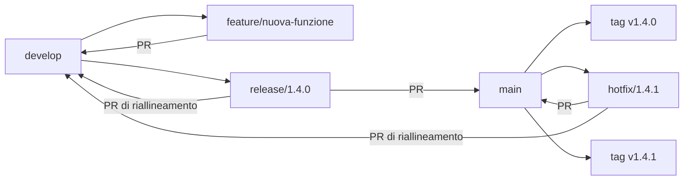

# GitFlow del progetto

Questo documento definisce i branch, le destinazioni delle pull request e il
processo di rilascio di AskMyDocs. È la regola operativa da seguire per evitare
che `main`, `develop` e i branch di lavoro divergano in modo ambiguo.

## Branch permanenti

- `main` rappresenta il codice in produzione. Ogni merge di release o hotfix
  deve essere seguito da un tag annotato `vX.Y.Z` sul commit risultante.
- `develop` integra il contenuto della prossima release. Deve contenere anche
  tutti gli hotfix già pubblicati su `main`.

Non si eseguono commit applicativi direttamente su questi branch: le modifiche
arrivano tramite pull request e CI verde.

## Branch temporanei e PR

| Lavoro | Branch di partenza | Nome | PR di destinazione |
| --- | --- | --- | --- |
| Feature o refactor | `develop` | `feature/<descrizione>` | `develop` |
| Preparazione release | `develop` | `release/<X.Y.Z>` | `main`, poi riallineamento verso `develop` |
| Correzione urgente in produzione | `main` | `hotfix/<X.Y.Z>` | `main`, poi riallineamento verso `develop` |

Una feature non viene normalmente proposta direttamente a `release/*`. Prima
si integra la feature in `develop`; quando lo scope è pronto si crea una sola
fotografia coerente di `develop` come branch di release. Questo evita di
ricomporre a mano nella release dipendenze tra feature e commit già presenti in
`develop`.

## Flusso feature

1. Aggiornare `develop` e creare `feature/<descrizione>` da quel commit.
2. Implementare e verificare la feature sul branch dedicato.
3. Se il branch non è condiviso, ribasarlo sul `develop` aggiornato prima della
   PR. Se è già condiviso, coordinare qualsiasi riscrittura della cronologia.
4. Aprire la PR `feature/<descrizione> -> develop`.
5. Dopo il merge, eliminare il branch temporaneo quando non serve più.

Esempio:

```bash
git switch develop
git pull --ff-only origin develop
git switch -c feature/nuova-funzione
# lavoro, test e commit
git fetch origin
git rebase origin/develop
git push -u origin feature/nuova-funzione
```

## Flusso release

Il branch `release/X.Y.Z` parte da `develop`, non da `main`. `main` è il punto
di arrivo della release; partire da `main` e aggiungere nuovamente i singoli
branch feature duplicherebbe il lavoro di integrazione già effettuato su
`develop`.

Prima di creare il branch:

1. Verificare che gli ultimi hotfix di `main` siano stati riallineati in
   `develop`, preferibilmente con una PR `main -> develop` o con il branch
   hotfix ancora disponibile.
2. Integrare in `develop`, tramite PR, tutte e sole le feature previste.
3. Ottenere CI, test applicativi ed E2E verdi su `develop`.
4. Decidere versione e scope; da questo momento vale il feature freeze.
5. Verificare che non restino dipendenze locali, path assoluti o vincoli
   `@dev` non riproducibili.

Creazione e pubblicazione:

```bash
git switch develop
git pull --ff-only origin develop
git switch -c release/X.Y.Z
git push -u origin release/X.Y.Z
```

Sul branch di release sono ammessi soltanto stabilizzazione, correzioni di
regressioni, versione, changelog e documentazione di rilascio. Nuove feature
tornano su `develop` e attendono una release successiva.

Quando la release è pronta:

1. Aprire la PR `release/X.Y.Z -> main` e attendere CI/review.
2. Dopo il merge, creare su `main` il tag annotato `vX.Y.Z` e pubblicarlo.
3. Riportare i commit di stabilizzazione in `develop` tramite PR
   `release/X.Y.Z -> develop`, oppure `main -> develop` se la policy del
   repository elimina subito il branch release.
4. Verificare che `main` sia antenato di `develop`, quindi eliminare il branch
   release.

```bash
git switch main
git pull --ff-only origin main
git tag -a vX.Y.Z -m "Release X.Y.Z"
git push origin vX.Y.Z
```

Non creare il branch né il tag finché versione, scope e gate non sono stati
approvati. Non forzare il push di un branch release condiviso.

## Flusso hotfix

1. Creare `hotfix/X.Y.Z` dall'ultimo `main` e dal relativo stato di produzione.
2. Applicare solo la correzione urgente e verificarla.
3. Aprire la PR `hotfix/X.Y.Z -> main`.
4. Dopo il merge, taggare `main` con `vX.Y.Z`.
5. Aprire subito la PR di riallineamento verso `develop`; se esiste una release
   attiva, riallineare anche quella.

## Diagramma



## Recupero e rinomina di branch storici

Prima di riscrivere un branch storico:

1. Identificare i commit realmente assenti da `develop`, inclusi eventuali
   squash merge equivalenti.
2. Creare un branch locale `backup/<nome>-pre-rebase-YYYYMMDD` al vecchio tip.
3. Rinominare il branch con il prefisso GitFlow appropriato.
4. Ribasare soltanto i commit ancora necessari sopra `develop`.
5. Risolvere i conflitti preservando le evoluzioni già presenti in `develop`.
6. Eseguire test mirati, typecheck e build prima di pubblicare.

Non eliminare il vecchio branch remoto e non eseguire force-push senza una
richiesta esplicita e senza aver verificato che nessun altro lo stia usando.

