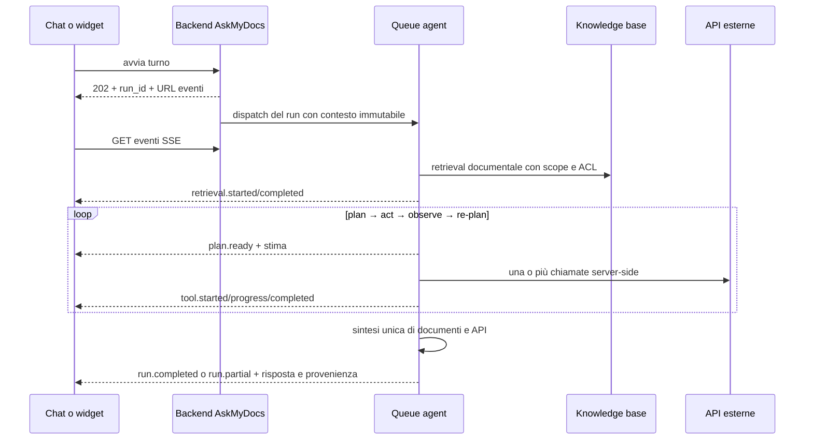

# Retrieval agentico: documenti e API live

Questo runbook descrive il percorso usato da chat autenticata e widget quando un
progetto dispone di almeno un tool API attivo. L'obiettivo è rispondere usando
insieme la knowledge base indicizzata e dati aggiornati recuperati da una o più
chiamate HTTP, incluse chiamate dipendenti e paginazione.

## Flusso di esecuzione



Il planner può creare azioni indipendenti o sequenziali. Prima del piano, un
router semantico seleziona al massimo otto capacità fra Knowledge Base, API e
MCP usando un manifest strutturale privo di istruzioni remote. Per esempio, alla
domanda «dammi gli ordini di Mario Rossi» può prima chiamare `find_customer`,
poi usare l'identificativo restituito in `list_orders`. I riferimenti tra azioni
hanno la forma chiusa `{"$from":"find_customer","path":"items.0.id"}` e il
path deve essere dichiarato dallo schema di output; quando lo schema non è noto,
il planner esegue il primo passo e ripianifica sul risultato reale. Non vengono
valutate espressioni o path arbitrari. Dopo ogni gruppo di azioni il
planner riceve soltanto il riepilogo delle evidenze e decide se rispondere,
chiamare altri tool oppure fermarsi per dati insufficienti.

La ricerca documentale iniziale e le successive ricerche KB rispettano tenant,
progetto, membership, filtri e ACL del run. I tool API sono selezionati dallo
stesso tenant e progetto. I tool MCP sono disponibili soltanto nel canale utente
autenticato. La sintesi finale conserva separatamente provenienza documentale e
provenienza API, poi produce una risposta unica con citazioni.

## Lingua e contesto immutabile

La lingua non viene ricalcolata durante l'esecuzione. All'avvio del run il
backend salva tenant, progetto, attore, canale, locale e timezone; il job in
queue ripristina e verifica lo stesso contesto prima di leggere dati o chiamare
un tool.

- Nella chat il locale proviene dal profilo autenticato.
- Nel widget proviene dal token identità firmato; in assenza del token viene
  usato il locale rilevato nello snapshot della pagina e normalizzato.
- Ogni evento contiene sia `locale` sia il testo già localizzato dal backend.
- Ogni chiamata API riceve `Accept-Language` con il locale del run. Le route
  possono inoltre usare `{{context.locale}}` e `{{context.language}}` nei
  parametri fissi.
- Il locale entra nella chiave cache del tool, evitando riuso tra lingue.
- La risposta finale usa il locale del run senza tradurre identificativi,
  numeri d'ordine, nomi, date o valori ricevuti dalle API.

Le lingue abilitate sono definite da `AGENT_SUPPORTED_LOCALES`; il fallback è
`APP_LOCALE`. Aggiungere una lingua richiede anche il catalogo
`lang/<lingua>/agent.php`.

## Budget adattivi e grandi collezioni

I limiti predefiniti distinguono chiamate logiche ai tool da richieste HTTP
fisiche prodotte da retry, paginazione o fan-out:

| Controllo | Default | Comportamento |
| --- | ---: | --- |
| Iterazioni plan/re-plan | 8 | restituisce un risultato parziale al limite |
| Azioni per singolo piano | 8 | rifiuta piani sovradimensionati |
| Chiamate logiche soft | 12 | estensione automatica solo per tool read-only e idempotenti |
| Chiamate logiche hard | 25 | chiede conferma prima di proseguire |
| Richieste HTTP fisiche hard | 100 | arresta paginazione/fan-out e chiede conferma |
| Errori consecutivi | 3 | interrompe il loop |
| Chiamate duplicate | 2 | impedisce loop sulla stessa firma tool+argomenti |
| Tempo interattivo / bulk | 60 s / 90 s | produce un risultato parziale |
| Evidenze accumulate | 512 KiB | evita crescita incontrollata del contesto |

Una lista di 50 ordini non consuma necessariamente 50 chiamate logiche: una
singola azione può scorrere fino a 100 pagine e produrre più richieste fisiche.
Il frontend mostra conteggio completato, stima minima/probabile/massima ed ETA.
Oltre il limite hard il run entra in `awaiting_confirmation`; l'utente può
concedere un'estensione bounded oppure fermarsi con le evidenze già raccolte.
Le estensioni massime sono controllate da
`AGENT_CONFIRMATION_LOGICAL_EXTENSION_MAX` e
`AGENT_CONFIRMATION_PHYSICAL_EXTENSION_MAX`.

Per cambiare i default vedere il blocco `AGENT_*` in `.env.example`. In
produzione lasciare sempre limiti finiti. Il pannello **Admin → API Connectors**
mostra la policy effettiva, le metriche tenant-scoped delle ultime 24 ore e i
run recenti senza prompt, risultati, argomenti o segreti. Lo stesso pannello
mostra confronti, divergenze, correzioni e fallback del capability planner.

## Rollout del capability planner

La chiave governabile `agent.planner.mode` può essere impostata per tenant o
progetto e accetta:

- `classic`: esegue soltanto il planner attuale;
- `shadow`: esegue il piano classico e genera un piano capability non eseguito;
- `capability`: esegue il nuovo router e planner, con fallback automatico al
  classico in caso di errore.

In shadow non vengono duplicate chiamate API/MCP. Il confronto mascherato viene
salvato per iterazione in `agent_planner_shadow_reports`. La prima release
espone al loop soltanto tool read-only che non richiedono conferma. Per avviare
il collaudo, lasciare `AGENT_PLANNER_MODE=classic` come default globale e
impostare `shadow` tramite App Settings sul tenant/progetto pilota; passare a
`capability` soltanto dopo la revisione delle metriche.

## Protocollo tra backend e frontend

La creazione del turno restituisce `202 Accepted`, un `run_id` e gli URL di
eventi, annullamento e continuazione. La chat usa
`POST /conversations/{conversation}/messages/agent`; il widget usa
`POST /api/widget/sessions/agent/start` per il primo turno e
`POST /api/widget/sessions/{session}/agent` per i successivi.

Lo stream è SSE, `Cache-Control: no-store`, ed è riprendibile con il parametro
`after` o l'header `Last-Event-ID`. Ogni frame contiene:

```json
{
  "run_id": "uuid",
  "sequence": 7,
  "type": "tool.progress",
  "phase": "tool",
  "locale": "it-IT",
  "message_key": "tool.progress",
  "message_params": { "completed": 4, "estimated": 10 },
  "message": "Completate 4 richieste API su circa 10.",
  "progress": {
    "logical": { "completed": 2, "estimated": { "min": 2, "likely": 3, "max": 4 } },
    "physical": { "completed": 4, "estimated": { "min": 4, "likely": 10, "max": 20 } },
    "eta_ms": 3200
  },
  "can_cancel": true,
  "data": {},
  "created_at": "2026-08-08T12:00:00Z"
}
```

Gli eventi principali sono `run.started`, `retrieval.started`,
`retrieval.completed`, `plan.created`, `plan.updated`, `plan.ready`,
`tool.started`, `tool.progress`, `tool.completed`, `tool.failed`,
`budget.extended`, `synthesis.started` e i terminali `run.completed`,
`run.partial`, `run.failed`, `run.cancelled`, `run.awaiting_confirmation`.
Le risposte MCP interattive emettono `run.mcp_interaction_required` e sospendono
il run in `awaiting_mcp_confirmation`, `awaiting_mcp_input` o
`waiting_mcp_task`, senza eseguire ulteriori azioni del piano.
Il client deduplica tramite `sequence` e si riconnette dopo una chiusura pulita
dello stream. La UI presenta l'attività in una barra separata dai messaggi, sia
nella chat sia nel widget. Il widget mantiene il vecchio flusso DOM/RAG quando
il progetto non ha tool API attivi.

## Prova con un server mock Oktodora

Usare preferibilmente un endpoint mock pubblico HTTPS, perché le protezioni
SSRF di produzione bloccano localhost, reti private, link-local e metadata
cloud. Preparare almeno queste due route:

1. `GET /customers?name=Mario%20Rossi`, risposta
   `{"items":[{"id":"cus_42","name":"Mario Rossi"}]}`.
2. `GET /customers/cus_42/orders?page=1`, risposta con `items` e un campo di
   continuazione coerente con la paginazione configurata, per esempio
   `{"items":[...],"meta":{"next_page":2,"has_more":true}}`.

Poi:

1. In **Admin → API Connectors** creare il connettore con la base URL HTTPS del
   mock e associarlo allo stesso progetto della conversazione/widget.
2. Configurare autenticazione e segreti nel vault, mai nei parametri visibili al
   modello.
3. Creare le due route, dichiarare soltanto i parametri controllabili dal
   modello e configurare la paginazione della route ordini.
4. Eseguire **Test connessione**, verificare schema inferito e descrizione del
   tool, quindi attivare entrambe le route.
5. Avviare un worker dedicato: `php artisan queue:work --queue=agent`.
6. Chiedere «Dammi tutti gli ordini di Mario Rossi». Verificare nella barra
   attività almeno due tool logici in sequenza, l'avanzamento delle pagine e una
   risposta finale che distingua fonti documentali e API.
7. Ripetere con profilo italiano e inglese: gli eventi, `Accept-Language` e la
   risposta devono restare nella lingua fissata all'avvio.
8. Provare annullamento, timeout/503 del mock e una collezione oltre il budget
   fisico. Il run deve terminare come cancelled, partial/failed o chiedere
   conferma senza superare silenziosamente i limiti.

Solo in sviluppo locale isolato si possono allentare HTTPS e risoluzione DNS
con `API_CONNECTOR_HTTPS_ONLY=false` e
`API_CONNECTOR_SSRF_RESOLVE_DNS=false`. L'URL guard continua comunque a
proteggere gli indirizzi esplicitamente vietati: non disabilitare
`API_CONNECTOR_SSRF_ENABLED` in ambienti condivisi o di produzione.

## Sicurezza e diagnosi

- URL, header, parametri fissi, credenziali e segreti restano server-side e non
  fanno parte dello schema dato al modello.
- Il controllo anti-IDOR verifica ad ogni accesso run, tenant, progetto,
  conversazione/sessione, widget key e identità.
- Prompt, evidenze, eventi, checkpoint e metadati delle esecuzioni passano dal
  masking PII prima della persistenza o dell'invio al client.
- Gli output del tool sono byte-capped; retry e cache sono configurabili per
  route. I `4xx` non vengono ritentati come errori transitori.
- Un `401/403/404` inatteso richiede di verificare membership, progetto, chiave
  widget e identità; un `409` indica in genere un run già attivo o non
  continuabile; un `503` del provider compare come fallimento localizzato del
  tool e il loop può usare le altre evidenze.
- Se la UI sembra ferma, verificare prima il worker `agent`, poi lo stream SSE e
  il suo ultimo `sequence`; il client deve ripartire da quel valore, non da zero.
