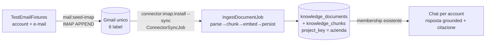

# Test end-to-end: ingest di e-mail reali via IMAP

Runbook operativo per verificare **tutto** il percorso
`e-mail vere → casella IMAP → connettore → ingest → chat` su aziende già
presenti nel sistema. Non si seedano righe finte nel DB: si inviano messaggi
**veri** dentro caselle IMAP **vere** (Gmail di test), poi si fa l'ingest da
quelle caselle, esattamente come in produzione.

> Harness di **dev/test**. Niente di tutto questo va abilitato in produzione
> (le credenziali `CONNECTOR_TEST_*` restano vuote sui deploy reali). È tooling
> CLI: per scelta non ha UI né endpoint HTTP dedicati (R44 — eccezione motivata).

---

## 0. Panoramica del flusso



Tre comandi compongono l'harness (tutti idempotenti, tenant `default`):

| Comando | Ruolo |
|---|---|
| `demo:list-companies` | Discovery read-only: quali aziende esistono, con quanti documenti/membri/connettori. |
| `mail:seed-imap` | Consegna (APPEND) le e-mail di test dentro le caselle IMAP. |
| `connector:imap:install` | Installa il connettore IMAP per azienda e (con `--sync`) avvia l'ingest. |

La sorgente dati unica è
[`database/seeders/TestEmailFixtures.php`](../../database/seeders/TestEmailFixtures.php):
caselle IMAP (`MAILBOXES`, 2 per azienda). Le **e-mail** di ogni casella (≥100,
di vario tipo + thread **domanda/risposta**) vivono in
`database/seeders/emails/<mailbox_key>.json` (generate via multi-agente,
versionate) e sono caricate da `TestEmailFixtures::emailsForMailbox()`. Ogni e-mail porta un
**"fatto-esca"** unico (un codice/nome/numero, es. `RL-2024-0815`, `Protocollo
Fenice-7`, `ClubPasso Aero`) che **non deve** comparire nelle risposte di
un'altra azienda: è il rilevatore di contaminazione del test di isolamento.

---

## 1. Prerequisiti

### 1.1 Aziende già presenti
Le fixtures coprono le 3 aziende del `CaseStudyUsersSeeder` (tenant `default`),
ognuna con **2 caselle logiche** (6 totali). Google limita gli account per
numero di telefono, quindi le 6 caselle sono **6 etichette (label) di UN UNICO
account Gmail** (campo `folder` nel fixture). Entrambe le label di un'azienda
confluiscono nello **stesso** `project_key`, quindi la sua KB raccoglie le e-mail
di tutte e due.

| project_key | Azienda | Caselle = label Gmail (mailbox_key) | Utente chat (pwd `password`) |
|---|---|---|---|
| `rotta-logistics` | Rotta Sicura Logistics | `rotta-logistics-1`, `rotta-logistics-2` | `rotta@case-study.local` |
| `prometeo-antincendio` | Prometeo Sicurezza Antincendio | `prometeo-antincendio-1`, `prometeo-antincendio-2` | `prometeo@case-study.local` |
| `passolibero-calzature` | PassoLibero Calzature | `passolibero-calzature-1`, `passolibero-calzature-2` | `passolibero@case-study.local` |

Assicurati che esistano (e abbiano già la documentazione markdown):

```bash
php artisan db:seed --class=Database\\Seeders\\RbacSeeder
php artisan db:seed --class=Database\\Seeders\\CaseStudyUsersSeeder
php artisan demo:list-companies
```

> Puntando il connettore al **project_key esistente** dell'azienda, l'utente
> case-study (già membro) vede subito le e-mail ingerite — nessun wiring extra.
> Se invece usi un project_key nuovo, ricordati la membership (vedi §6).

### 1.2 Account Gmail di test (uno solo)
Serve **UN solo account Gmail** (`TestEmailFixtures::ACCOUNT_EMAIL`, default
`rotta.test1.askmydocs@gmail.com`). Le 6 caselle sono **etichette** create
automaticamente da `mail:seed-imap` (IMAP CREATE) al primo invio — NON servono 6
account. Su quell'account:
1. Attiva la verifica in due passaggi.
2. Crea una **App Password** (Google Account → Sicurezza → Password per le app).
   La password normale **non** funziona con IMAP.
3. Abilita **IMAP** (Gmail → Impostazioni → Inoltro e POP/IMAP → IMAP attivo).

> Nota Gmail: un messaggio appeso a una label NON entra in INBOX (sta nella label
> + "Tutti i messaggi"); il connettore sincronizza SOLO la label inclusa → niente
> doppioni tra aziende.

### 1.3 `.env`
I parametri di connessione + le label stanno nel fixture
[`TestEmailFixtures`](../../database/seeders/TestEmailFixtures.php) — in `.env`
serve SOLO la App Password dell'account condiviso (segreto, mai committato):

```dotenv
CONNECTOR_TEST_GMAIL_PASSWORD=<app-password-account-condiviso>
```

Override globale opzionale (raro): `CONNECTOR_TEST_IMAP_HOST` / `_PORT` /
`_ENCRYPTION` / `_DATE_WINDOW_DAYS` sovrascrivono i valori del fixture (es. per
puntare a un altro server IMAP invece di Gmail).

### 1.4 Coda + provider AI (per l'ingest reale)
L'ingest è asincrono e genera embedding → richiede:

- **Coda attiva**: o `QUEUE_CONNECTION=sync` (ingest inline, più semplice per il
  test) **oppure** un worker in parallelo: `php artisan queue:work`.
- **Provider AI** configurati: `AI_EMBEDDINGS_PROVIDER` (+ relativa API key) per
  generare gli embedding in ingest, e `AI_PROVIDER` (+ key) per la chat finale.

---

## 2. Discovery — cosa c'è già

```bash
php artisan demo:list-companies            # tutte le aziende/progetti
php artisan demo:list-companies --tenant=default
```

Mostra per ogni `project_key`: nome, #documenti, #chunk, membri (chi può
chattare) e se c'è un connettore. Evidenzia anche i **project_key orfani**
(documenti ma nessuna riga `projects`/membership): è lo stato "la chat non trova
niente". Usalo prima e dopo l'ingest per misurare la differenza.

---

## 3. Anteprima delle e-mail (dry-run, senza credenziali)

```bash
php artisan mail:seed-imap --all --dry-run
```

Costruisce e mostra ogni messaggio senza inviare nulla né leggere le password.
Utile per controllare contenuti/oggetti prima della consegna reale.

---

## 4. Consegna delle e-mail nelle caselle (APPEND)

```bash
# tutte le caselle (6)
php artisan mail:seed-imap --all

# tutte le caselle di un'azienda (espande ai 2 mailbox_key)
php artisan mail:seed-imap --project=rotta-logistics

# una singola casella
php artisan mail:seed-imap --mailbox=rotta-logistics-2

# re-run pulito: prima rimuove i messaggi di test già presenti (DISTRUTTIVO,
# tocca SOLO i messaggi con header X-AskMyDocs-Seed di quella casella)
php artisan mail:seed-imap --all --purge
```

Dettagli:
- I messaggi di una casella vengono **APPESI** nella sua **label** (creata se
  manca) in un **unico batch** (una connessione per casella — robusto con 100+
  e-mail) via webklex;
  la data di consegna (INTERNALDATE) è `now()`, così le e-mail (datate 2024 nelle
  fixtures) restano dentro la finestra `date_window_days` del connettore.
- Su errori di **connessione transitori** il client ritenta automaticamente
  (R42); su errori di **autenticazione** si ferma subito con messaggio chiaro
  (R14). Nessun fallimento silenzioso.
- Verifica anche da web: apri la casella Gmail e controlla che le e-mail siano
  in arrivo.

---

## 5. Installazione connettore + ingest

> **Vincolo importante — un solo connettore IMAP per tenant.**
> `connector_installations` ha UNIQUE `(tenant_id, connector_name)`: nel tenant
> `default` esiste **una sola** riga `imap`. L'harness la riusa **una casella
> alla volta** (6 caselle in totale), azzerando il cursore di sync ad ogni
> (ri)configurazione così il sync successivo è un **FULL clean** della casella
> corrente. I documenti già ingeriti restano (l'ingest è additivo per
> project_key; `reconcile_deletions` è OFF di default → riconfigurare non
> cancella nulla). Le 2 caselle di un'azienda confluiscono nello stesso
> project_key.

```bash
# tutte le caselle: configura+sincronizza in modo SERIALIZZATO (1→sync→2→…).
# Con più caselle --sync è OBBLIGATORIO (vedi vincolo sopra).
php artisan connector:imap:install --all --sync

# tutte le caselle di un'azienda (2 mailbox), attore per l'audit
php artisan connector:imap:install --project=prometeo-antincendio --actor=super@demo.local --sync

# una singola casella
php artisan connector:imap:install --mailbox=rotta-logistics-1 --sync
```

Cosa fa per ogni casella:
- Riusa `ConfigureConnectorService` → **verifica davvero** le credenziali
  (ping IMAP) prima di portare l'installazione ad `ACTIVE`.
- Salva `config_json` con `connection.*`, `project_key = <azienda>`,
  `folders.include = ["<label>"]` (solo la label della casella: evita i doppioni
  di INBOX/"Tutti i messaggi") e `date_window_days`. La password va nel **vault cifrato**,
  mai in `config_json`. Azzera `last_sync_at` + `mailboxes_state` (FULL clean).
- Con `--sync`:
  - **più caselle** → esegue il `ConnectorSyncJob` **sincrono e serializzato**
    (ogni casella viene ingerita prima di riconfigurare la riga per la prossima:
    senza serializzazione i job in coda leggerebbero tutti l'ultima config);
  - **una casella** → **accoda** un `ConnectorSyncJob` (parità con l'admin
    "sync now"): assicurati che la coda giri (§1.4).

`--all`/più caselle **senza** `--sync` viene **rifiutato** (fallirebbe in
silenzio lasciando solo l'ultima casella configurata). Senza `--sync` su una
singola casella l'ingest parte comunque dallo scheduler (ogni 15 min) o
ridispacciando il job.

---

## 6. Membership (solo se usi un project_key nuovo)

L'ingest da connettore **non** crea automaticamente `projects` né
`project_memberships`. Se hai puntato il connettore a un `project_key` che non
ha membri, la chat non troverà nulla. Sblocca con i comandi esistenti:

```bash
php artisan auth:grant rotta@case-study.local viewer --project=<nuovo-project_key>
# oppure, per creare anche la riga projects + utente:
php artisan demo:seed-user --email=rotta@case-study.local --project=<key> --role=viewer
```

Con le 3 aziende case-study e il connettore puntato al loro project_key
esistente, **questo passo non serve**.

---

## 7. Verifica ingest

```bash
php artisan demo:list-companies
```

Il conteggio `docs`/`chunks` dell'azienda deve essere aumentato delle e-mail
ingerite. In alternativa controlla dall'admin (KB tree) o via DB.

---

## 8. Test di chat per account (incl. isolamento)

Per ogni azienda, **login come l'utente dell'azienda** e fai una domanda la cui
risposta sta in una e-mail ingerita; verifica la risposta grounded + citazione.

Esempi (usa il "fatto-esca" come sonda):

| Azienda / utente | Domanda | Deve contenere | Non deve mai contenere |
|---|---|---|---|
| `rotta@case-study.local` | «Qual è il codice della spedizione Consegna Lampo 24h?» | `RL-2024-0815`, `VeloxCorriere` | `Protocollo Fenice-7`, `ClubPasso` |
| `prometeo@case-study.local` | «Qual è il protocollo del rinnovo CPI dell'edificio B-MI-07?» | `Protocollo Fenice-7`, `CPI` | `RL-2024-0815`, `ClubPasso` |
| `passolibero@case-study.local` | «Qual è il modello recensito 5 stelle e l'ordine collegato?» | `ClubPasso Aero`, `#CLB-5521` | `Protocollo Fenice-7`, `VeloxCorriere` |

**Test di isolamento (cross-tenant/cross-project)**: ponendo a un account la
domanda di un'altra azienda, la risposta deve essere un rifiuto "nessun
contesto" — mai il fatto-esca dell'altra azienda. Se trapela, c'è una falla di
isolamento (R30) da investigare.

---

## 9. Troubleshooting

| Sintomo | Causa probabile | Rimedio |
|---|---|---|
| `mail:seed-imap` → "Env var ... non impostata" | App Password mancante in `.env` | Compila `CONNECTOR_TEST_GMAIL_PASSWORD`. |
| "Env var ... non impostata" anche con password presente nel `.env` | Config cache attiva: il fixture legge `env()` e sotto `config:cache` ritorna `null` | `php artisan config:clear` prima di lanciare l'harness (l'harness è dev/test: non usare la config cache). |
| APPEND fallisce con auth error | Password normale invece dell'App Password, o IMAP off | Usa l'App Password; abilita IMAP. |
| Le e-mail non vengono ingerite | Fuori finestra temporale | L'APPEND usa INTERNALDATE=now(); se hai forzato date vecchie alza `CONNECTOR_TEST_IMAP_DATE_WINDOW_DAYS`. |
| Doppioni di e-mail | Più `mail:seed-imap` senza `--purge` | Usa `--purge`; ogni casella è una label isolata e il connettore include solo quella label. |
| Ingest non parte | Coda non attiva | `QUEUE_CONNECTION=sync` o `php artisan queue:work`. |
| La chat non trova le e-mail | project_key senza membership (orfano) | Punta il connettore al project_key dell'azienda, o §6. |
| Embedding error in ingest | Provider AI non configurato | Imposta `AI_EMBEDDINGS_PROVIDER` + API key. |

---

## 10. Estendere ad altre aziende

Vedi il prompt agnostico
[`email-ingest-prompt.md`](email-ingest-prompt.md): individua le aziende
presenti con `demo:list-companies`, aggiunge l'account + le e-mail (con
fatto-esca) in `TestEmailFixtures`, le App Password in `.env`, e rigira i
comandi §3–§8.
